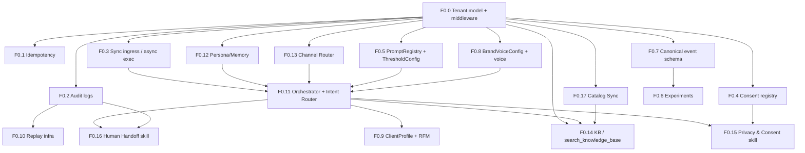

# ai-bot-platform — Phase 0 Foundation Design

**Status:** v2 — Approved with revisions (post tech-lead review)
**Author:** Software Architect (paired with tech lead)
**Date:** 2026-05-07 (v1) / 2026-05-09 (v2)
**Audience:** 2 dev + tech lead, **~20 weeks** to ship Phase 0
**Inputs locked:** Q1-Q7 + A-G + **17 Foundation Blocks** (see brief + this doc)

## Changelog v1 → v2 (post-review)

| Change | Section | Reason |
|---|---|---|
| Sprint plan 16→20 weeks (7→10 sprints) | §2.3, §8.2 | CR-1: original Sprints 5/6/7 carried 2-3× workload of any prior sprint |
| New **F0.17 Catalog Sync** block added | §2.4, §8, F0 list | CR-2: catalog sync was prose-mentioned but had no owner/sprint/dep |
| Sprint 1 adds OpenAI **circuit breaker + cached fallback** | §2.3 Sprint 1 | CR-3: removes single-point-of-failure window before multi-LLM ships |
| Sprint 0 adds `mysite/maxbot/` **freeze policy** | §2.3 Sprint 0 | IM-1: prevent drift between source-of-truth and `legacy_maxbot/` copy |
| `STRICT_TENANT_SCOPE` audit window 4w → **2w** | §6.2 | IM-2: synthetic traffic only, faster tightening safe |
| Replay sampling prod **10% → 100%** | §7.1 | IM-3: 1 tenant + low traffic, full coverage cheap |
| `apps/orchestrator/voice/` → `apps/orchestrator/safety/voice_check.py` | §1 | IM-4: name collision with `apps/voice/` confused |
| R6 burnout mitigation hardened | §9 | IM-5: original mitigation was "lead reviews more" = more lead load |
| New **ADR-0006: Field-level encryption (django-cryptography)** | §10 | IM-6: `EncryptedJSONField` was unspecified |

---

## 0. Executive summary

We are building `ai-bot-platform` — a multi-tenant AI-bot platform for beauty/wellness salons. Phase 0 (**~20 weeks**, 2 dev + lead) ships **the foundation that everything else stands on**: tenancy, idempotency, audit, ingress, consent, prompt registry, experiments, events, brand voice, client profile, replay, orchestrator, persona/memory, channel routing, FAQ/RAG, privacy skill, human handoff, **catalog sync from `mysite/`**. After Phase 0 the platform can host one production tenant (`formula_tela` on MAX) with a closed feedback loop and is structurally ready to onboard a second tenant without rewrites.

**Three architectural axes:**

1. **Probabilistic vs deterministic split.** LLM understands intent and drafts text; tools (idempotent, typed) do side effects; safety gates wrap both. No tool ever called from "raw model text" — only via structured tool calls validated against a schema.
2. **Sync ingress / async execution.** Webhook handler does auth + dedup + journal + 200 OK in <300ms. Real work runs on workers reading from a Redis Streams job bus. This protects MAX (30s timeout, 10 retry) and YClients (no retry, one-shot) semantics simultaneously.
3. **Tenant-as-first-class.** Every row, every cache key, every chromadb namespace, every log line carries `tenant_id`. There is no "default tenant" path. Cross-tenant leakage is treated like SQL injection — tested with automated scanners.

**Key non-goals (Phase 0):** self-service onboarding, billing, multi-region, mobile apps, voice/audio channels, full skill catalog (only 3 baseline skills wired end-to-end: FAQ, Privacy, Handoff). Booking, Nutrition, Aftercare, Reminders, Reactivation arrive in Phase 1+.

**Key risks driving the design:**
- Tenant_id leak (cross-tenant data exposure) — mitigated via TenantContext middleware + `for_tenant()` Manager + automated SQL scanner test.
- PII in replay traces (152-ФЗ) — mitigated via mandatory PII redaction layer before persistence + retention policy on `ReplayTrace`.
- Effort overflow — mitigated by deferring 19 of 22 functional skills to Phase 1+, by reusing `ayla-ai-core` for AI primitives, by carrying `mysite/maxbot/` over as `legacy_maxbot/` and refactoring incrementally.

**Recommendation:** approve as-is. Trade-offs are explicit. Three optional simplifications (multi-LLM router can defer to Phase 1; replay can start as text dump and grow into golden fixtures over Sprint 4-6; experiments can ship without holdout in Sprint 6 if we are behind) listed inline.

---

## 1. Repo structure

```
ai-bot-platform/
├── README.md
├── pyproject.toml                          # uv/poetry, Python 3.12+
├── manage.py
├── docker-compose.yml                      # postgres + redis + chromadb + minio (S3) + app + worker
├── Dockerfile
├── .env.example
├── .github/workflows/                      # ci.yml, deploy-dev.yml, deploy-prod.yml, replay.yml
│
├── platform/                               # Django project package (settings, urls, wsgi, asgi, celery)
│   ├── settings/
│   │   ├── base.py
│   │   ├── local.py
│   │   ├── staging.py
│   │   └── production.py                  # fail-fast on missing env vars
│   ├── urls.py
│   ├── celery.py
│   └── asgi.py                             # ASGI for webhook endpoints + websockets later
│
├── apps/
│   ├── tenancy/                            # Tenant model, TenantContext middleware, create_tenant cmd
│   │   ├── models.py                       # Tenant, EncryptedField utilities
│   │   ├── middleware.py                   # TenantContextMiddleware
│   │   ├── managers.py                     # TenantScopedManager (for_tenant)
│   │   ├── context.py                      # threadlocal storage + async ContextVar
│   │   └── management/commands/create_tenant.py
│   │
│   ├── identity/                           # BotUser, ClientProfile (RFM/LTV/tier), identity resolution
│   │   ├── models.py
│   │   ├── services/
│   │   │   ├── resolver.py                 # phone-as-key, channel→user mapping
│   │   │   ├── rfm.py                      # daily recompute job
│   │   │   ├── ltv.py                      # actual + predicted_ltv_12m
│   │   │   ├── churn.py                    # churn risk score
│   │   │   └── tier.py                     # Bronze/Silver/Gold/Platinum policy
│   │   └── tasks.py                        # Celery: recompute_profile, daily_rfm
│   │
│   ├── conversations/                      # Conversation, Message, lifecycle
│   │   ├── models.py
│   │   └── services/lifecycle.py           # IDLE→CONSULTING→…
│   │
│   ├── orchestrator/                       # The brain
│   │   ├── pipeline.py                     # main turn() pipeline
│   │   ├── intent_router.py                # gpt-4o-mini structured JSON
│   │   ├── safety/
│   │   │   ├── pre_check.py                # regex keyword guard
│   │   │   ├── post_check.py               # forbidden patterns guard
│   │   │   ├── voice_check.py              # post-LLM voice validation (was apps/orchestrator/voice/validator.py)
│   │   │   └── policy.py                   # risk_level matrix
│   │   ├── memory/
│   │   │   ├── short_term.py               # Redis session
│   │   │   ├── long_term.py                # Postgres profile facts
│   │   │   └── builder.py                  # context assembly per turn
│   │   ├── llm/
│   │   │   ├── provider.py                 # LLMProvider protocol
│   │   │   ├── openai_provider.py          # + circuit breaker (Sprint 1)
│   │   │   ├── anthropic_provider.py       # Sprint 7 if time permits
│   │   │   └── router.py                   # cost-routing, fallback
│   │   └── prompts/
│   │       └── registry.py                 # PromptRegistry live reload
│   │
│   ├── skills/                             # Skill base + 3 baseline skills in Phase 0
│   │   ├── base.py                         # SkillBase, SkillContext, SkillResult
│   │   ├── registry.py                     # name → class lookup
│   │   ├── faq/                            # search_knowledge_base
│   │   │   ├── skill.py
│   │   │   └── prompts.yaml
│   │   ├── privacy_consent/                # 152-ФЗ data export/delete
│   │   │   ├── skill.py
│   │   │   └── prompts.yaml
│   │   └── human_handoff/                  # transcript-preserving handoff
│   │       ├── skill.py
│   │       └── prompts.yaml
│   │
│   ├── tools/                              # Deterministic side-effect tools
│   │   ├── base.py                         # ToolContract, idempotency wrapper
│   │   ├── registry.py
│   │   ├── search_knowledge_base.py
│   │   ├── send_notification.py
│   │   ├── create_admin_task.py
│   │   ├── handoff_to_human.py
│   │   └── idempotency.py                  # IdempotencyKey storage + dedup
│   │
│   ├── kb/                                 # Knowledge base + chromadb adapter
│   │   ├── models.py                       # KbDocument
│   │   ├── ingester.py                     # markdown→chunks→embeddings
│   │   ├── retriever.py                    # filter-first then vector
│   │   └── chromadb_client.py              # per-tenant collection naming
│   │
│   ├── channels/                           # Adapters: MAX (Phase 0), Telegram (Phase 1), WhatsApp (Phase 2)
│   │   ├── base.py                         # ChannelAdapter ABC, ChannelMessage DTO
│   │   ├── max/
│   │   │   ├── adapter.py
│   │   │   ├── webhook.py                  # FastAPI/DRF endpoint
│   │   │   ├── outbound.py                 # send_message, upload_media
│   │   │   └── parser.py                   # MAX update → ChannelMessage
│   │   └── router.py                       # channel registry, profile sync
│   │
│   ├── ingress/                            # Webhook intake, dedup, journal
│   │   ├── views.py                        # HTTP handlers per channel
│   │   ├── journal.py                      # IngressEvent persistence
│   │   ├── dedup.py                        # idempotency on channel_message_id
│   │   └── job_bus.py                      # Redis Streams enqueue
│   │
│   ├── workers/                            # Async execution
│   │   ├── consumer.py                     # Redis Streams consumer group
│   │   └── tasks.py                        # Celery wrappers (audit, replay, recompute)
│   │
│   ├── consent/                            # ConsentRecord, lifecycle
│   │   ├── models.py
│   │   └── services.py                     # grant, withdraw, has_consent
│   │
│   ├── audit/                              # AuditLog, before/after diff
│   │   ├── models.py
│   │   └── services.py                     # write_audit(action, before, after)
│   │
│   ├── events/                             # Canonical event schema, fan-out
│   │   ├── models.py                       # Event
│   │   ├── schema.py                       # event envelope dataclass
│   │   ├── tracker.py                      # emit() helper
│   │   └── fanout.py                       # Mixpanel/GA4/warehouse adapter (Phase 1+)
│   │
│   ├── experiments/                        # Experiment + UserAssignment + holdout
│   │   ├── models.py
│   │   ├── bucketing.py                    # sticky hash(user_id, exp_name) → variant
│   │   ├── holdout.py                      # 5% global holdout
│   │   ├── analysis.py                     # statistical significance check
│   │   └── admin.py
│   │
│   ├── voice/                              # BrandVoiceConfig (per-tenant) + glue to ayla-ai-core
│   │   ├── models.py                       # BrandVoiceConfig
│   │   ├── service.py                      # wraps ayla_ai_core.voice
│   │   ├── services/
│   │   │   └── rewriter.py                 # KB content voice-pass (was apps/orchestrator/voice/rewriter.py)
│   │   └── admin.py
│   │
│   ├── catalog/                            # F0.17 — Catalog mirror synced from mysite/
│   │   ├── models.py                       # Service, Master, FAQ (read-only mirrors)
│   │   ├── sync_service.py                 # CatalogSyncService (Celery beat, 15-min)
│   │   ├── client.py                       # HTTP client to mysite/api/v1/catalog/
│   │   └── tasks.py                        # sync_catalog Celery task
│   │
│   ├── replay/                             # trace_id + traces + redaction + runner
│   │   ├── models.py                       # ReplayTrace
│   │   ├── recorder.py                     # capture pipeline state
│   │   ├── redactor.py                     # PII redaction (regex + NER)
│   │   ├── runner.py                       # CLI: replay run --fixture-set X
│   │   ├── differ.py                       # text + tool_calls + voice diff
│   │   └── fixtures/
│   │       ├── salon-consultant/
│   │       ├── faq/
│   │       ├── handoff/
│   │       └── adversarial/                # safety regression set
│   │
│   ├── promptreg/                          # PromptRegistry + ThresholdConfig + DisclaimerLibrary
│   │   ├── models.py                       # PromptVersion, ThresholdConfig, DisclaimerLibrary
│   │   ├── registry.py                     # in-memory cache + signal-based reload
│   │   ├── canary.py                       # traffic_percent rollout
│   │   ├── signals.py                      # post_save → publish to Redis pub/sub
│   │   └── admin.py                        # custom Django Admin views
│   │
│   ├── adminconsole/                       # Django Admin overrides + custom views
│   │   ├── apps.py
│   │   ├── views/
│   │   │   ├── prompt_diff.py
│   │   │   ├── experiment_detail.py
│   │   │   ├── client_profile.py           # RFM card per client
│   │   │   └── replay_view.py              # replay any conversation
│   │   └── templates/
│   │
│   └── handoff/                            # AdminTask formal handoff queue
│       ├── models.py                       # AdminTask
│       └── services.py                     # transcript packaging
│
├── legacy_maxbot/                          # mysite/maxbot/ carried over AS-IS (Sprint 0)
│   └── …                                   # incrementally drained into apps/* by Sprint 6
│
├── tests/
│   ├── conftest.py                         # tenant fixtures
│   ├── tenancy/test_isolation.py           # cross-tenant scanner
│   ├── orchestrator/test_pipeline.py
│   ├── replay/test_runner.py
│   ├── kb/test_retrieval.py
│   ├── voice/test_validator.py
│   └── e2e/test_max_to_faq.py              # webhook → FAQ → response
│
├── deployments/
│   ├── docker-compose.dev.yml
│   ├── k8s/                                # Phase 1+ if/when we move off systemd
│   └── systemd/                            # Phase 0: matches mysite prod pattern
│
└── docs/
    ├── architecture.md                     # this doc condensed + diagrams
    ├── adr/
    │   ├── ADR-0001-multi-tenant-ready.md
    │   ├── ADR-0002-repo-separation.md
    │   ├── ADR-0003-tenant-context.md
    │   ├── ADR-0004-stack.md
    │   └── ADR-0005-multi-llm-routing.md
    └── runbooks/
        ├── tenant-onboarding.md
        └── replay-debugging.md
```

**One-line role per top-level dir:**
- `platform/` — Django project shell, settings, celery wiring.
- `apps/tenancy/` — the tenant boundary (model + middleware + scoped queries).
- `apps/identity/` — who the user is across channels (BotUser + ClientProfile + RFM).
- `apps/conversations/` — Conversation lifecycle and Messages.
- `apps/orchestrator/` — pipeline brain: intent router, safety, memory, voice, LLM, prompts.
- `apps/skills/` — domain skills, base class, FAQ + Privacy + Handoff in Phase 0.
- `apps/tools/` — deterministic operations with idempotency and contracts.
- `apps/kb/` — knowledge base ingester + chromadb retriever.
- `apps/channels/` — channel adapters (MAX in Phase 0).
- `apps/ingress/` — webhook intake, dedup, durable journal.
- `apps/workers/` — Redis Streams consumer + Celery tasks.
- `apps/consent/` — consent registry (152-ФЗ + GDPR).
- `apps/audit/` — append-only audit trail.
- `apps/events/` — canonical event schema and fan-out.
- `apps/experiments/` — A/B framework with sticky bucketing.
- `apps/voice/` — per-tenant BrandVoiceConfig glue + KB rewriter.
- `apps/catalog/` — read-only mirror of `mysite/` catalog (Service, Master, FAQ); 15-min Celery sync.
- `apps/replay/` — traces, redaction, runner, fixtures, differ.
- `apps/promptreg/` — PromptRegistry + ThresholdConfig + DisclaimerLibrary with live reload.
- `apps/adminconsole/` — Django Admin overrides.
- `apps/handoff/` — AdminTask queue.
- `legacy_maxbot/` — Sprint-0 import as-is, drained over time.

---

## 2. Migration path: `mysite/maxbot/` → `ai-bot-platform/`

### 2.1 Snapshot of `mysite/maxbot/` today

- 9 routers (start, services, booking, contacts, faq, reminders, ai_callbacks, ai_assistant, fallback).
- `ai_concierge.py` with 6 OpenAI tools.
- Phase 3 nutrition: nutrition_anketa.py, food_scanner.py, water.py, daily_report.py via Ayla.
- N2 reminder system.
- MCP server `services/formulatela_mcp/` (chromadb embeddings, FAQ).
- Celery tasks (reminders, post-visit follow-up, repeat offers).
- YClients webhook handler.

### 2.2 Migration principle

**`mysite/` stays the salon-specific Django site.** It owns the catalog (`Service`, `Master`, `FAQ`, `HelpArticle`, `BookingRequest`, `Promotion`), the SEO landings, the public website, the YClients integration data side, the SEO/marketing agents, the payment flow.

**`ai-bot-platform/` becomes the bot platform.** It owns `Tenant`, `BotUser`, `ClientProfile`, `Conversation`, `Message`, the pipeline, prompts, voice, KB, and channel adapters.

**Catalog flows from `mysite/` → platform via a sync job** (Celery, every 15 min, idempotent upsert by `external_service_id`). Platform never writes back to `mysite/` catalog. This breaks the cycle and lets us run the platform in its own deployment.

### 2.3 Sprint-by-sprint plan (10 sprints × 2 weeks = 20 weeks)

**Sprint 0 (week 1-2) — Bootstrap (Lead solo, dev1+dev2 onboarding)**
- Create `ai-bot-platform` repo.
- Scaffold Django 5.2 + DRF 3.15 project with `apps/` layout.
- Docker compose: postgres + redis + chromadb + minio.
- CI skeleton (pytest, ruff, mypy).
- Copy `mysite/maxbot/` → `legacy_maxbot/` AS-IS (no edits).
- Make `legacy_maxbot/` import-only (entry-point still on `mysite/`; platform doesn't run bot yet).
- **Freeze policy on `mysite/maxbot/`** (IM-1):
  - Add `mysite/maxbot/.FROZEN` marker file with policy text.
  - CODEOWNERS: only tech lead approves PRs touching `mysite/maxbot/**`.
  - README banner: "Source-of-truth for migration; new development happens in ai-bot-platform/. Critical security fixes only — must be cherry-picked into `legacy_maxbot/` same PR."
- Write ADR-0001 through ADR-0006.
- **Exit gate:** `pytest tests/smoke/` passes; `legacy_maxbot/` is importable but disabled; freeze docs published.

**Sprint 1 (week 3-4) — Tenant + idempotency + audit + ingress + LLM circuit breaker (F0.0/F0.1/F0.2/F0.3 + CR-3)**
- `apps/tenancy/`: Tenant model, EncryptedJSONField (via `django-cryptography`), TenantContextMiddleware, `for_tenant()` Manager.
- `apps/audit/`: AuditLog model + `write_audit()` helper.
- `apps/tools/idempotency.py`: IdempotencyKey storage.
- `apps/ingress/`: webhook journal + dedup + Redis Streams enqueue.
- `apps/workers/consumer.py`: stream consumer group skeleton.
- `manage.py create_tenant --slug formula-tela`.
- **OpenAI circuit breaker + cached fallback** (CR-3, ~2 days):
  - `apps/orchestrator/llm/openai_provider.py` with circuit breaker (opens after 5 failures in 60s).
  - Cached fallback template "Извини, у меня сейчас короткий технический сбой — я отвечу через минуту".
  - Sentry alert + Telegram alert to admin on breaker open.
  - This stands until Sprint 7 multi-LLM lands; ensures **no single-point-of-failure window**.
- Tests: cross-tenant leakage scanner.
- **Exit gate:** `create_tenant` works; webhook → journal → stream → consumer logs message; LLM circuit breaker tested with simulated outage.

**Sprint 2 (week 5-6) — Identity + conversations + memory + channel adapter (F0.12, F0.13, partial F0.0)**
- `apps/identity/`: BotUser model + phone-as-key resolver.
- `apps/conversations/`: Conversation + Message models with full status enum.
- `apps/orchestrator/memory/`: short-term Redis + long-term Postgres.
- `apps/channels/max/`: full MAX adapter (parser, outbound, webhook).
- Carry `legacy_maxbot/handlers/start.py` logic into `apps/channels/max/`.
- **Exit gate:** webhook → ingress → adapter → BotUser resolved → Conversation created → echo handler responds via MAX outbound.

**Sprint 3 (week 7-8) — Consent + privacy skill + handoff + events (F0.4, F0.7, F0.15, F0.16)**
- `apps/consent/`: ConsentRecord + lifecycle (grant, withdraw, query).
- `apps/events/`: canonical schema + Event model + emit().
- `apps/skills/privacy_consent/`: data export/delete skill.
- `apps/skills/human_handoff/`: transcript-preserving handoff.
- `apps/handoff/`: AdminTask model + transcript packaging.
- **Exit gate:** "/удалить мои данные" works end-to-end; "оператора" creates AdminTask with transcript.

**Sprint 4 (week 9-10) — PromptRegistry + Experiments + BrandVoice (F0.5, F0.6, F0.8)**
- `apps/promptreg/`: PromptVersion + ThresholdConfig + DisclaimerLibrary with Redis pub/sub live reload.
- Custom Django Admin views: prompt diff, canary rollout slider.
- `apps/experiments/`: Experiment + UserAssignment + sticky bucketing + 5% holdout.
- `apps/voice/`: BrandVoiceConfig wiring to `ayla-ai-core` voice utils.
- `apps/orchestrator/safety/voice_check.py`: post-LLM voice validator integrated into pipeline.
- `apps/voice/services/rewriter.py`: KB content voice rewriter.
- **STRICT_TENANT_SCOPE flips to strict in tests + staging** (IM-2; prod stays in audit until Sprint 8 shadow).
- **Exit gate:** edit prompt in admin → bot uses new prompt within 5 sec without restart.

**Sprint 5 (week 11-12) — Replay infrastructure (F0.10, full sprint)**
- `apps/replay/`: ReplayTrace model + recorder + redactor + differ.
- `apps/replay/runner.py`: CLI replay tool.
- PII redaction layer (regex-only in Phase 0; NER deferred).
- Golden fixture library: 30 fixtures across faq/privacy/handoff (curated this sprint).
- Adversarial fixture library: 25 safety fixtures (curated with cosmetologist input — booked Sprint 4).
- Voice regression set: 20 fixtures (built from `mysite/maxbot/voice_examples.py` history).
- CI workflow `.github/workflows/replay.yml` runs golden + adversarial on every PR.
- **Replay sampling: 100% in Phase 0 prod** (IM-3; 1 tenant + low traffic = ~30MB/30d retention).
- **Exit gate:** `python -m platform.replay run --fixture-set golden` passes 30/30; CI blocks PRs that break golden set.

**Sprint 6 (week 13-14) — ClientProfile + RFM + tier + Orchestrator (F0.9 + F0.11 partial)**
- `apps/identity/services/`: rfm.py, ltv.py, churn.py, tier.py.
- Daily Celery `recompute_profiles` task.
- Signal-based real-time updates on Booking events (Phase 1 will hook actual Booking; Phase 0 wires the signal contract only).
- `apps/orchestrator/pipeline.py`: full turn() pipeline wiring all layers (memory → router → safety → skill → tools → safety → composer).
- `apps/orchestrator/intent_router.py`: gpt-4o-mini structured JSON output.
- `apps/orchestrator/safety/pre_check.py + post_check.py`: keyword regex guards.
- **Exit gate:** ClientProfile populated from synthetic visit data; orchestrator pipeline runs end-to-end with FAQ stub skill.

**Sprint 7 (week 15-16) — KB/RAG + FAQ skill + multi-LLM (F0.14 + F0.11 finish + F0.17 catalog sync)**
- `apps/kb/`: ingester + retriever + chromadb per-tenant collection.
- `apps/skills/faq/`: full FAQ skill using `search_knowledge_base` tool.
- Migrate `services/formulatela_mcp/` chromadb data to platform's chromadb.
- `apps/orchestrator/llm/`: LLMProvider Protocol + OpenAI provider hardened. **Anthropic provider** if time permits (otherwise Phase 1 — but we already have circuit breaker from Sprint 1).
- **F0.17 Catalog Sync** (CR-2):
  - `apps/catalog/`: CatalogSyncService Celery beat task.
  - HTTP client to `mysite/api/v1/catalog/{services|masters|faqs}/?since=<ts>`.
  - Platform-side mirror models: `Service`, `Master`, `FAQ` (read-only).
  - Conflict policy: `mysite/` always wins; idempotent upsert by `external_id`.
  - 15-min cadence + on-demand `refresh_catalog` admin action.
  - mysite/ side: new DRF endpoint `/api/v1/catalog/...` (read-only for platform's service token).
- **Exit gate:** "сколько стоит массаж?" → FAQ skill → KB hit → voice-validated answer end-to-end through MAX; catalog sync runs cleanly.

**Sprint 8 (week 17-18) — Observability + shadow mode**
- OpenTelemetry instrumentation across pipeline (trace_id propagation).
- Sentry SDK for error tracking.
- Structured JSON logs with tenant_id + trace_id.
- **STRICT_TENANT_SCOPE flips to strict in prod** (IM-2 timing — 2 weeks of test+staging clean = sufficient).
- Shadow mode launch: platform subscribes to webhook copy via nginx tee; `mysite/` remains primary; platform writes shadow Conversation/Message; **no outbound** to user.
- Daily delta dashboard: platform predicted action vs `mysite/` actual action — measure accuracy.
- **Exit gate:** 7 consecutive days shadow mode, ≥95% intent agreement with `mysite/maxbot/` baseline, zero strict_tenant_scope violations in prod logs.

**Sprint 9 (week 19-20) — Canary cutover (10% → 50%) + runbooks**
- Canary routing 10% MAX traffic to platform (by stable hash of `bot_user.id`).
- Daily review: error rate, latency p95, NPS proxy (handoff rate).
- After 5 clean days at 10% → 50%.
- Runbooks: tenant onboarding, replay debugging, incident response, rollback procedure (flip nginx upstream).
- Phase 1 backlog grooming based on Phase 0 learnings.
- **Exit gate:** 50% MAX traffic on platform for 5 days, error rate <1%, p95 turn latency <3s, no critical incidents.

**Sprint 10 (week 21-22) — Full cutover + soak**
- 100% MAX traffic to platform.
- `legacy_maxbot/` routers disabled progressively; N2 reminders + booking flow stay in `mysite/` (Phase 1 ports).
- 7-day soak at 100%; on-call rotation; daily metrics review.
- Phase 0 retro + Phase 1 plan kickoff.
- **Exit gate:** 100% MAX traffic on platform for 7 consecutive days, error rate <1%, p95 turn latency <3s, runbook tested via simulated incident.

### 2.4 What stays in `mysite/`

- **Forever:** website (`website/`), services_app (catalog, masters, FAQ, landings — **source of truth**), agents (SEO/marketing), payments, public Django admin for catalog, SEO infrastructure.
- **Phase 0 only (delegated execution):** N2 reminder Celery tasks (`maxbot/tasks.py`), YClients booking write paths, post-visit follow-up, **Phase 3 nutrition flow** (food scanner / water tracker / anketa stays in `mysite/maxbot/` until Phase 1 ports). The platform sends `send_notification` tool calls to a thin shim that proxies to `mysite/` notifications/maxbot until Phase 1 ports them.
- **Catalog sync direction:** `mysite/services_app.Service|Master|FAQ` → platform `apps/catalog/Service|Master|FAQ` (read-only mirror) via **F0.17 Catalog Sync Service** (Celery beat, 15-min cadence + on-demand admin trigger).
- **New mysite/ endpoint required (Sprint 7 dependency):** `GET /api/v1/catalog/{services|masters|faqs}/?since=<ts>` returning incremental changes since timestamp; auth via service token; read-only.

### 2.5 Carry-over file map (Sprint 0)

| `mysite/maxbot/` file | Disposition |
|---|---|
| `ai_concierge.py` | Refactored in Sprint 6 → `apps/orchestrator/pipeline.py`. AS-IS in Sprint 0. |
| `ai_tools.py` | Refactored in Sprint 6 → `apps/tools/registry.py` + per-tool modules. |
| `ai_tool_handlers.py` | Refactored Sprint 6 → `apps/tools/*.py`. |
| `ai_action_service.py` | Phase 1 (booking writes). Stays in `legacy_maxbot/`. |
| `ai_context.py` | Refactored Sprint 5 → `apps/orchestrator/memory/builder.py`. |
| `ai_prompts.py` | Refactored Sprint 4 → `apps/promptreg/registry.py` (DB-driven). |
| `ai_ui.py` | Refactored Sprint 6 → `apps/channels/max/outbound.py`. |
| `ai_yclients.py` | Phase 1 (booking enrichment). Stays. |
| `mcp_client.py` | Replaced Sprint 6 by `apps/kb/chromadb_client.py`; chromadb runs as service. |
| `llm.py` | Refactored Sprint 6 → `apps/orchestrator/llm/openai_provider.py`. |
| `reminders_factory.py` | Phase 1. Stays in `mysite/`. |
| `tasks.py` (Celery) | Phase 1. Stays in `mysite/`. |
| `yclients_webhook.py` | Phase 1. Stays in `mysite/`. |
| `handlers/` (9 routers) | Drained progressively Sprint 2-7. |

---

## 3. Core data model

This section gives Django model skeletons. Every model has a `tenant` FK (except `Tenant` itself and global `Holdout`), `created_at`/`updated_at`, and indexes on `(tenant_id, frequently_queried_field)`.

### 3.1 Tenancy

```python
# apps/tenancy/models.py
class Tenant(models.Model):
    id = models.BigAutoField(primary_key=True)
    slug = models.SlugField(unique=True, max_length=64)              # 'formula-tela'
    name = models.CharField(max_length=255)
    is_active = models.BooleanField(default=True)
    plan = models.CharField(max_length=32, default='standard')       # for future SaaS billing
    timezone = models.CharField(max_length=64, default='Europe/Moscow')
    locale = models.CharField(max_length=8, default='ru')
    channel_tokens = EncryptedJSONField(default=dict)                # {'max': 'tok_...', 'tg': '...'}
    features = models.JSONField(default=dict)                        # {'nutrition': True, 'reminders': True}
    brand_voice = models.OneToOneField('voice.BrandVoiceConfig', null=True, on_delete=models.SET_NULL)
    created_at = models.DateTimeField(auto_now_add=True)

    class Meta:
        indexes = [models.Index(fields=['slug'])]
```

### 3.2 Identity & Profile

```python
# apps/identity/models.py
class BotUser(models.Model):
    id = models.UUIDField(primary_key=True, default=uuid.uuid4)
    tenant = models.ForeignKey(Tenant, on_delete=models.CASCADE, related_name='bot_users')
    channel = models.CharField(max_length=16)                        # 'max' | 'tg' | 'wa'
    channel_user_id = models.CharField(max_length=128)               # MAX user_id, TG chat_id
    phone = models.CharField(max_length=24, blank=True, db_index=True)
    display_name = models.CharField(max_length=128, blank=True)
    client_name = models.CharField(max_length=128, blank=True)       # how user introduced themselves
    chat_id = models.CharField(max_length=128, blank=True)           # for proactive sends
    first_seen = models.DateTimeField(auto_now_add=True)
    last_seen = models.DateTimeField(auto_now=True)

    class Meta:
        unique_together = [('tenant', 'channel', 'channel_user_id')]
        indexes = [
            models.Index(fields=['tenant', 'phone']),
            models.Index(fields=['tenant', 'last_seen']),
        ]


class ClientProfile(models.Model):
    """Computed per-bot-user, refreshed daily + on signal events.

    All fields are derived. Source of truth lives in Booking facts elsewhere.
    """
    bot_user = models.OneToOneField(BotUser, primary_key=True, on_delete=models.CASCADE)
    tenant = models.ForeignKey(Tenant, on_delete=models.CASCADE)

    # RFM
    recency_days = models.IntegerField(null=True)                    # days since last visit
    frequency_visits = models.IntegerField(default=0)
    monetary_total = models.DecimalField(max_digits=12, decimal_places=2, default=0)
    rfm_segment = models.CharField(max_length=32, blank=True)        # 'champion','loyal','at_risk','hibernating',…

    # LTV
    ltv = models.DecimalField(max_digits=12, decimal_places=2, default=0)
    predicted_ltv_12m = models.DecimalField(max_digits=12, decimal_places=2, default=0)

    # Risk
    churn_risk = models.FloatField(default=0)                        # 0..1
    lifecycle_stage = models.CharField(max_length=32, blank=True)    # new/active/lapsing/churned

    # Behavior
    avg_visit_interval_days = models.IntegerField(null=True)
    favorite_service_id = models.CharField(max_length=64, blank=True)
    favorite_category_id = models.CharField(max_length=64, blank=True)
    preferred_master_id = models.CharField(max_length=64, blank=True)

    # Loyalty
    loyalty_tier = models.CharField(max_length=16, default='bronze') # bronze|silver|gold|platinum
    last_recomputed_at = models.DateTimeField(null=True)
```

### 3.3 Conversation lifecycle

```python
# apps/conversations/models.py
class Conversation(models.Model):
    """States from spec: IDLE | CONSULTING | BOOKING_FLOW | AWAITING_CONFIRMATION
    | FOOD_LOGGING | HUMAN_HANDOFF | ESCALATED.
    Outcome: success | abandoned | redirected | error (set on close)."""

    class State(models.TextChoices):
        IDLE = 'idle'
        CONSULTING = 'consulting'
        BOOKING_FLOW = 'booking_flow'
        AWAITING_CONFIRMATION = 'awaiting_confirmation'
        FOOD_LOGGING = 'food_logging'
        HUMAN_HANDOFF = 'human_handoff'
        ESCALATED = 'escalated'

    class Outcome(models.TextChoices):
        SUCCESS = 'success'
        ABANDONED = 'abandoned'
        REDIRECTED = 'redirected'
        ERROR = 'error'

    id = models.UUIDField(primary_key=True, default=uuid.uuid4)
    tenant = models.ForeignKey(Tenant, on_delete=models.CASCADE)
    bot_user = models.ForeignKey(BotUser, on_delete=models.CASCADE, related_name='conversations')

    state = models.CharField(max_length=32, choices=State.choices, default=State.IDLE)
    outcome = models.CharField(max_length=16, choices=Outcome.choices, blank=True)
    risk_level = models.CharField(max_length=8, default='low')       # low|medium|high
    current_skill = models.CharField(max_length=64, blank=True)
    slot_state = models.JSONField(default=dict)

    is_active = models.BooleanField(default=True)
    last_message_at = models.DateTimeField(auto_now_add=True)
    started_at = models.DateTimeField(auto_now_add=True)
    closed_at = models.DateTimeField(null=True)
    deleted_at = models.DateTimeField(null=True)

    class Meta:
        indexes = [
            models.Index(fields=['tenant', 'bot_user', 'is_active']),
            models.Index(fields=['tenant', 'last_message_at']),
        ]
        constraints = [
            models.UniqueConstraint(
                fields=['bot_user'],
                condition=models.Q(is_active=True),
                name='unique_active_conversation_per_user',
            )
        ]


class Message(models.Model):
    class Role(models.TextChoices):
        USER = 'user'
        ASSISTANT = 'assistant'
        TOOL = 'tool'
        SYSTEM = 'system'

    id = models.UUIDField(primary_key=True, default=uuid.uuid4)
    tenant = models.ForeignKey(Tenant, on_delete=models.CASCADE)
    conversation = models.ForeignKey(Conversation, on_delete=models.CASCADE, related_name='messages')

    role = models.CharField(max_length=16, choices=Role.choices)
    content = models.TextField(blank=True)
    rendered_text = models.TextField(blank=True)                     # what user actually saw

    # Tool / action
    action_type = models.CharField(max_length=64, blank=True)        # 'show_masters', 'show_slots', …
    action_data = models.JSONField(default=dict)
    tool_call = models.JSONField(default=dict)                       # raw OpenAI tool_call
    tool_call_id = models.CharField(max_length=64, blank=True)

    # Telemetry
    trace_id = models.CharField(max_length=64, db_index=True)
    intent = models.CharField(max_length=64, blank=True)
    skill_used = models.CharField(max_length=64, blank=True)
    risk_level = models.CharField(max_length=8, default='low')
    tokens_in = models.IntegerField(null=True)
    tokens_out = models.IntegerField(null=True)
    latency_ms = models.IntegerField(null=True)

    created_at = models.DateTimeField(auto_now_add=True)

    class Meta:
        indexes = [
            models.Index(fields=['conversation', 'created_at']),
            models.Index(fields=['tenant', 'trace_id']),
        ]
```

### 3.4 Skill & Tool registry, prompts, thresholds, disclaimers

```python
# apps/skills/models.py
class Skill(models.Model):
    tenant = models.ForeignKey(Tenant, on_delete=models.CASCADE)
    skill_name = models.CharField(max_length=64)
    version = models.IntegerField(default=1)
    prompt = models.ForeignKey('promptreg.PromptVersion', on_delete=models.PROTECT)
    tools_whitelist = models.JSONField(default=list)                 # ['search_knowledge_base', …]
    is_active = models.BooleanField(default=True)
    created_at = models.DateTimeField(auto_now_add=True)
    class Meta:
        unique_together = [('tenant', 'skill_name', 'version')]


# apps/tools/models.py
class Tool(models.Model):
    tool_name = models.CharField(max_length=64, primary_key=True)
    schema = models.JSONField()                                      # JSON schema for LLM tool def
    idempotency_required = models.BooleanField(default=False)
    side_effect_class = models.CharField(max_length=16)              # 'read'|'write'|'send'|'medical'


# apps/promptreg/models.py
class PromptVersion(models.Model):
    """Versioned prompts for skills. Live reload via Redis pub/sub."""
    tenant = models.ForeignKey(Tenant, on_delete=models.CASCADE)
    skill_name = models.CharField(max_length=64)
    body = models.TextField()
    version = models.IntegerField()
    traffic_percent = models.IntegerField(default=100)               # canary rollout
    is_active = models.BooleanField(default=False)
    created_by = models.ForeignKey('auth.User', on_delete=models.PROTECT)
    published_at = models.DateTimeField(null=True)
    created_at = models.DateTimeField(auto_now_add=True)

    class Meta:
        unique_together = [('tenant', 'skill_name', 'version')]
        indexes = [models.Index(fields=['tenant', 'skill_name', 'is_active'])]


class ThresholdConfig(models.Model):
    tenant = models.ForeignKey(Tenant, on_delete=models.CASCADE)
    key = models.CharField(max_length=64)                            # 'intent_confidence_min', 'food_scan_min'
    value = models.DecimalField(max_digits=10, decimal_places=4)
    applied_to = models.CharField(max_length=64, blank=True)         # skill name; '' = global
    version = models.IntegerField(default=1)
    is_active = models.BooleanField(default=True)
    class Meta:
        unique_together = [('tenant', 'key', 'applied_to', 'version')]


class DisclaimerLibrary(models.Model):
    tenant = models.ForeignKey(Tenant, on_delete=models.CASCADE)
    category = models.CharField(max_length=32)                       # 'medical', 'pricing', 'aftercare'
    risk_level = models.CharField(max_length=8)                      # 'medium' | 'high'
    text = models.TextField()
    version = models.IntegerField(default=1)
    is_active = models.BooleanField(default=True)
    withdrawn_at = models.DateTimeField(null=True)
```

### 3.5 Brand voice

```python
# apps/voice/models.py
class BrandVoiceConfig(models.Model):
    """Per-tenant voice. Glue layer; actual logic lives in ayla-ai-core."""
    tenant = models.OneToOneField(Tenant, on_delete=models.CASCADE, related_name='brand_voice_config')
    persona = models.JSONField(default=dict)                         # name, role, age, traits
    tone_vector = models.JSONField(default=dict)                     # warmth, formality, energy as floats
    forbidden_phrases = models.JSONField(default=list)               # regex patterns
    voice_examples = models.JSONField(default=list)                  # in-context learning
    tone_modulations = models.JSONField(default=dict)                # by risk_level / sentiment
    version = models.IntegerField(default=1)
    is_active = models.BooleanField(default=True)
    updated_at = models.DateTimeField(auto_now=True)
```

### 3.6 Experiments

```python
# apps/experiments/models.py
class Experiment(models.Model):
    class Status(models.TextChoices):
        DRAFT = 'draft'
        RUNNING = 'running'
        PAUSED = 'paused'
        COMPLETED = 'completed'

    tenant = models.ForeignKey(Tenant, on_delete=models.CASCADE)
    name = models.SlugField(max_length=64)                           # 'router_threshold_v2'
    hypothesis = models.TextField()
    status = models.CharField(max_length=16, choices=Status.choices, default=Status.DRAFT)
    primary_kpi = models.CharField(max_length=64)                    # 'booking_conversion_rate'
    guardrails = models.JSONField(default=list)                      # [{'metric':'handoff_rate','max_delta':0.05}]
    variants = models.JSONField()                                    # [{'name':'control','weight':50}, {'name':'v2','weight':50}]
    started_at = models.DateTimeField(null=True)
    ended_at = models.DateTimeField(null=True)
    class Meta:
        unique_together = [('tenant', 'name')]


class UserAssignment(models.Model):
    bot_user = models.ForeignKey(BotUser, on_delete=models.CASCADE)
    experiment = models.ForeignKey(Experiment, on_delete=models.CASCADE)
    variant = models.CharField(max_length=32)
    assigned_at = models.DateTimeField(auto_now_add=True)
    class Meta:
        unique_together = [('bot_user', 'experiment')]


class Holdout(models.Model):
    """Global 5% holdout — these users never receive any experiment treatment.
    Used as long-term baseline for total-platform impact measurement."""
    bot_user = models.OneToOneField(BotUser, primary_key=True, on_delete=models.CASCADE)
    since = models.DateTimeField(auto_now_add=True)
```

### 3.7 Consent & audit

```python
# apps/consent/models.py
class ConsentRecord(models.Model):
    class Type(models.TextChoices):
        PERSONAL_DATA = 'personal_data'                              # 152-ФЗ
        MARKETING = 'marketing'
        PHOTO_BIOMETRIC = 'photo_biometric'                          # special category
        HEALTH = 'health'

    tenant = models.ForeignKey(Tenant, on_delete=models.CASCADE)
    bot_user = models.ForeignKey(BotUser, on_delete=models.CASCADE, related_name='consents')
    consent_type = models.CharField(max_length=32, choices=Type.choices)
    source = models.CharField(max_length=64)                         # 'first_message', 'photo_request', 'admin_set'
    document_version = models.CharField(max_length=32)               # privacy notice version hash
    granted = models.BooleanField()
    captured_at = models.DateTimeField()
    withdrawn_at = models.DateTimeField(null=True)
    class Meta:
        indexes = [models.Index(fields=['tenant', 'bot_user', 'consent_type'])]


# apps/audit/models.py
class AuditLog(models.Model):
    tenant = models.ForeignKey(Tenant, on_delete=models.CASCADE)
    actor_type = models.CharField(max_length=16)                     # 'user'|'bot'|'admin'|'system'
    actor_id = models.CharField(max_length=64)
    action = models.CharField(max_length=64)                         # 'booking.create','prompt.publish'
    object_type = models.CharField(max_length=32)
    object_id = models.CharField(max_length=64)
    before_data = models.JSONField(null=True)
    after_data = models.JSONField(null=True)
    trace_id = models.CharField(max_length=64, db_index=True)
    ts = models.DateTimeField(auto_now_add=True, db_index=True)
    class Meta:
        indexes = [
            models.Index(fields=['tenant', 'object_type', 'object_id']),
            models.Index(fields=['tenant', 'ts']),
        ]
```

### 3.8 Events, replay, KB, admin tasks

```python
# apps/events/models.py
class Event(models.Model):
    tenant = models.ForeignKey(Tenant, on_delete=models.CASCADE)
    event_name = models.CharField(max_length=64)                     # 'booking_created','message_sent', …
    distinct_id = models.CharField(max_length=128)                   # tenant_X:user_Y
    bot_user = models.ForeignKey(BotUser, on_delete=models.SET_NULL, null=True)
    conversation = models.ForeignKey(Conversation, on_delete=models.SET_NULL, null=True)
    properties = models.JSONField(default=dict)
    trace_id = models.CharField(max_length=64, db_index=True)
    ts = models.DateTimeField(auto_now_add=True, db_index=True)
    class Meta:
        indexes = [
            models.Index(fields=['tenant', 'event_name', 'ts']),
        ]


# apps/replay/models.py
class ReplayTrace(models.Model):
    tenant = models.ForeignKey(Tenant, on_delete=models.CASCADE)
    trace_id = models.CharField(max_length=64, primary_key=True)
    conversation = models.ForeignKey(Conversation, on_delete=models.SET_NULL, null=True)
    pipeline_steps = models.JSONField()                              # ordered list of step snapshots
    redacted = models.BooleanField(default=False)                    # PII redacted?
    redaction_method = models.CharField(max_length=32, blank=True)   # 'regex_v1'|'ner_v1'
    captured_at = models.DateTimeField(auto_now_add=True, db_index=True)
    expires_at = models.DateTimeField(db_index=True)                 # retention 30d default
    class Meta:
        indexes = [models.Index(fields=['tenant', 'captured_at'])]


# apps/kb/models.py
class KbDocument(models.Model):
    tenant = models.ForeignKey(Tenant, on_delete=models.CASCADE)
    doc_type = models.CharField(max_length=32)                       # service|master|contraindication|faq|legal
    source_uri = models.CharField(max_length=512)
    version = models.CharField(max_length=32)
    locale = models.CharField(max_length=8, default='ru')
    metadata = models.JSONField(default=dict)
    checksum = models.CharField(max_length=64)
    content = models.TextField()
    # Embeddings live in chromadb collection f"tenant_{tenant_id}_kb"; this row is the source of truth.
    class Meta:
        unique_together = [('tenant', 'source_uri', 'version')]


# apps/handoff/models.py
class AdminTask(models.Model):
    class Type(models.TextChoices):
        HANDOFF = 'handoff'
        COMPLAINT = 'complaint'
        MEDICAL_RISK = 'medical_risk'
        FINANCIAL = 'financial'

    class Priority(models.TextChoices):
        LOW = 'low'; MEDIUM = 'medium'; HIGH = 'high'; URGENT = 'urgent'

    class Status(models.TextChoices):
        OPEN = 'open'; ASSIGNED = 'assigned'; RESOLVED = 'resolved'; CANCELLED = 'cancelled'

    tenant = models.ForeignKey(Tenant, on_delete=models.CASCADE)
    type = models.CharField(max_length=16, choices=Type.choices)
    priority = models.CharField(max_length=8, choices=Priority.choices, default=Priority.MEDIUM)
    bot_user = models.ForeignKey(BotUser, on_delete=models.CASCADE)
    conversation = models.ForeignKey(Conversation, on_delete=models.SET_NULL, null=True)
    description = models.TextField()
    context_summary = models.TextField()                             # auto-built transcript summary
    transcript_snapshot = models.JSONField(default=list)             # frozen messages at handoff time
    assigned_to = models.ForeignKey('auth.User', on_delete=models.SET_NULL, null=True)
    status = models.CharField(max_length=16, choices=Status.choices, default=Status.OPEN)
    created_at = models.DateTimeField(auto_now_add=True)
    resolved_at = models.DateTimeField(null=True)
```

### 3.9 Indexing & partitioning notes

- All `tenant_id`-scoped tables get a composite index `(tenant_id, …)` on every query path.
- `Event` table will partition by month after ~10M rows (Phase 1 task — flag now).
- `Message`, `AuditLog`, `ReplayTrace` are write-heavy and read-mostly — ok with B-tree; revisit if Postgres CPU > 60%.
- `chromadb` collections per tenant: `f"tenant_{tenant.id}_kb"`. Never share a collection across tenants.

---

## 4. Skill base class hierarchy

```python
# apps/skills/base.py
from dataclasses import dataclass, field
from typing import Any, Protocol, runtime_checkable

@dataclass(frozen=True)
class SkillContext:
    tenant: 'Tenant'
    bot_user: 'BotUser'
    client_profile: 'ClientProfile | None'
    conversation: 'Conversation'
    incoming_message: 'Message'
    dialog_history: list['Message']                                  # last 10
    retrieved_passages: list['RetrievedPassage'] = field(default_factory=list)
    current_state: str = 'idle'
    trace_id: str = ''
    brand_voice: 'BrandVoiceCfg | None' = None                       # ayla-ai-core dataclass
    threshold_overrides: dict[str, float] = field(default_factory=dict)


@dataclass(frozen=True)
class ToolCallSpec:
    tool_name: str
    args: dict[str, Any]
    idempotency_key: str | None = None


@dataclass(frozen=True)
class SkillResult:
    response_text: str
    tool_calls_made: list[ToolCallSpec] = field(default_factory=list)
    action_type: str | None = None
    action_data: dict[str, Any] | None = None
    next_state: str | None = None
    voice_check_passed: bool = True
    risk_level: str = 'low'                                          # low|medium|high
    tokens_in: int = 0
    tokens_out: int = 0
    latency_ms: int = 0


class SkillBase:
    """Abstract base for all skills.

    Subclasses MUST set `name` and `tools_whitelist`. They override `handle()`.
    The base class enforces:
      * pre-safety hook (block disallowed before LLM call)
      * tools whitelist (a skill can only call its declared tools)
      * post-safety hook (forbidden patterns + voice check)
      * brand voice integration (delegates to ayla_ai_core.voice)
      * structured error handling (raises SkillError; pipeline catches)
    """

    name: str = ''                                                   # 'faq', 'privacy_consent', …
    tools_whitelist: tuple[str, ...] = ()
    requires_consent: tuple[str, ...] = ()                           # e.g. ('personal_data',)

    async def handle(self, ctx: SkillContext) -> SkillResult:
        raise NotImplementedError

    # base-class helpers (don't override unless you know why)
    def assert_tool_allowed(self, tool_name: str) -> None:
        if tool_name not in self.tools_whitelist:
            raise SkillSecurityError(f"{self.name} cannot call {tool_name}")

    async def voice_check(self, draft: str, ctx: SkillContext) -> tuple[bool, str]:
        from ayla_ai_core.voice import validate_against_voice
        return validate_against_voice(draft, ctx.brand_voice)
```

**Guarantee for skills using `ayla-ai-core`:** the platform never reimplements voice validation, persona dataclasses, anti-hallucination guards, or tool schema utilities. The `apps/voice/service.py` module is a thin glue that loads `BrandVoiceConfig` from DB → constructs `ayla_ai_core.voice.BrandVoiceCfg` → passes into `SkillContext`. If `ayla-ai-core` releases breaking changes, only `apps/voice/service.py` is touched.

---

## 5. Orchestrator design — full pipeline

### 5.1 End-to-end flow

```
inbound HTTPS POST /webhook/<channel>/
  → channels/<channel>/webhook.py: verify auth header (X-Max-Bot-Api-Secret), parse, ack 200 ASAP
  → ingress/journal.py: persist IngressEvent (raw payload + checksum), dedup on (channel, channel_message_id)
  → ingress/job_bus.py: XADD on Redis stream f"jobs:{tenant_slug}:turn"
  → workers/consumer.py: XREADGROUP picks up
  → orchestrator/pipeline.py::turn(channel_message):
      1. resolve tenant from channel adapter context
      2. resolve_bot_user(tenant, channel, channel_user_id) → BotUser
      3. resolve_or_create_conversation(bot_user) → Conversation (one active)
      4. save Message(role=user) with trace_id
      5. memory.short_term.load(conversation) + memory.long_term.load(bot_user) → MemorySnapshot
      6. intent_router.classify(text, MemorySnapshot, brand_voice) → IntentDecision
         { intent, skill, confidence, risk_level, missing_slots, reply_mode, needs_rag, needs_tool }
      7. safety.pre_check(text, intent_decision) → allow|clarify|block|handoff
         (regex keyword guard; medical / acute symptoms / forbidden topics)
      8. if blocked → respond with disclaimer; goto step 14 with action_type='blocked'
      9. if handoff → enqueue AdminTask; goto step 14 with action_type='handoff'
     10. skill = registry.get(intent_decision.skill)
         skill_result = await skill.handle(SkillContext(...))
     11. for tool_call in skill_result.tool_calls_made:
            tool = tools.registry.get(tool_call.tool_name)
            skill.assert_tool_allowed(tool_call.tool_name)
            tool.invoke(args, idempotency_key=tool_call.idempotency_key)
     12. safety.post_check(skill_result.response_text, ctx) → allow|revise|block
         (forbidden patterns regex + brand voice validator)
     13. response_composer.compose(skill_result, brand_voice) → final text + UI keyboard
     14. save Message(role=assistant, content, action_type, action_data, tool_call,
                      tokens_in/out, latency_ms, intent, skill_used, trace_id, risk_level)
     15. memory.short_term.update(conversation, slot_state)
     16. events.emit('message_sent', { … })
     17. audit.write_audit('message.create', before=None, after=msg.serialized(), trace_id=…)
     18. replay.recorder.capture(trace_id, pipeline_steps_snapshot)  # sampled in prod
     19. channels/<channel>/outbound.py: send_message(...)
```

### 5.2 Per-step latency budget

| Step | Budget | Notes |
|---|---|---|
| Webhook ack | <300ms | MAX timeout 30s but we keep it tight |
| Ingress journal + enqueue | <50ms | Postgres insert + Redis XADD |
| Consumer pickup | <500ms | depends on backlog |
| Memory load | <100ms | Redis + 1 Postgres query |
| Intent router (gpt-4o-mini) | <1500ms | structured JSON, 200 tokens out cap |
| Safety pre-check | <10ms | regex |
| Skill handle (LLM) | <2500ms | gpt-4o-mini default; gpt-4o for high-risk |
| Tool calls | <2000ms | per tool; KB search <500ms |
| Safety post-check + voice | <50ms | regex + small LLM optional |
| Response composer | <50ms | template render |
| Save + emit + audit + replay | <200ms | batched DB writes |
| Outbound send | <500ms | MAX API |
| **Total p95 turn** | **<4000ms** | Goal; alert at 6000ms |

### 5.3 Failure handling

- LLM timeout → fallback to clarify message + Sentry alert.
- Tool error → return ErrorResult to skill; skill decides handoff vs retry.
- Channel send fails → retry 3x with backoff → DLQ + AdminTask.
- Webhook handler always returns 200 (even on internal failure) — don't trigger MAX retry storms.
- Pipeline crash → outer try/except → save Message(role=system, content="error"), emit `pipeline_error` event, send fallback "Извините, что-то пошло не так".

### 5.4 Why async ingress / sync workers

YClients delivers webhooks once with no retry. MAX retries up to 10 times within 30s if we don't ACK. Telegram retries up to 7 days on 5xx. **Three different semantics** — one bug in our stack and we either lose events (YClients) or get duplicate side effects (Telegram). The journal-then-enqueue pattern serializes all three behind one consistent contract: "we own the event the moment it's in the journal; the upstream can stop retrying."

---

## 6. Multi-tenant patterns

### 6.1 TenantContext middleware

```python
# apps/tenancy/context.py
from contextvars import ContextVar
_current_tenant: ContextVar['Tenant | None'] = ContextVar('current_tenant', default=None)

def get_current_tenant() -> 'Tenant':
    t = _current_tenant.get()
    if t is None:
        raise RuntimeError("Tenant context not set — every code path must run inside TenantContext")
    return t

def set_tenant(tenant): return _current_tenant.set(tenant)
def reset_tenant(token): _current_tenant.reset(token)


# apps/tenancy/middleware.py
class TenantContextMiddleware:
    def __init__(self, get_response): self.get_response = get_response

    def __call__(self, request):
        tenant = self._resolve_tenant(request)                        # from URL prefix or header or token
        if tenant is None:
            return JsonResponse({'error': 'tenant_unresolved'}, status=400)
        token = set_tenant(tenant)
        try:
            request.tenant = tenant
            return self.get_response(request)
        finally:
            reset_tenant(token)
```

For workers: every job message carries `tenant_id`. Worker consumer wraps `pipeline.turn(...)` in `with tenant_scope(tenant): ...`. No code path runs without an active tenant.

### 6.2 Query scoping

```python
# apps/tenancy/managers.py
class TenantScopedManager(models.Manager):
    def for_tenant(self, tenant):
        return self.get_queryset().filter(tenant=tenant)

    def get_queryset(self):
        # SAFE-MODE: in DEBUG raise if no tenant context.
        from .context import _current_tenant
        if settings.STRICT_TENANT_SCOPE:
            t = _current_tenant.get()
            if t is None:
                raise RuntimeError(f"{self.model.__name__}.objects called outside tenant scope")
            return super().get_queryset().filter(tenant=t)
        return super().get_queryset()
```

We turn on `STRICT_TENANT_SCOPE = True` in tests + staging from Sprint 4 (when first E2E flows ship). In production we run it in *audit mode* — raises a Sentry event but doesn't crash, so a bug doesn't take down prod, but ops sees it instantly. **After 2 weeks of clean prod logs (Sprint 8 shadow mode + early canary)** we flip to strict. The 2-week window (down from original 4 weeks) is sufficient because Phase 0 prod traffic is synthetic-heavy until canary cutover; we don't need long real-traffic soak before tightening.

### 6.3 Cache namespacing

All Redis keys: `f"t:{tenant.id}:{namespace}:{key}"`. A small wrapper `apps/tenancy/cache.py::TenantCache` enforces this — direct `cache.set/get` is forbidden in code review.

### 6.4 Chromadb collections

`apps/kb/chromadb_client.py::get_collection(tenant)` returns `chroma_client.get_or_create_collection(name=f"tenant_{tenant.id}_kb")`. Never call `chroma_client.collection(name=…)` directly in skill code.

### 6.5 Test fixtures

```python
# tests/conftest.py
@pytest.fixture
def tenant_a(db):
    t = Tenant.objects.create(slug='tenant-a', name='A')
    BrandVoiceConfig.objects.create(tenant=t, persona={'name': 'Алина'})
    return t

@pytest.fixture
def tenant_b(db):
    return Tenant.objects.create(slug='tenant-b', name='B')

@pytest.fixture
def in_tenant_a(tenant_a):
    token = set_tenant(tenant_a)
    yield tenant_a
    reset_tenant(token)
```

### 6.6 Cross-tenant leakage scanner (test)

```python
# tests/tenancy/test_isolation.py
def test_cross_tenant_query_blocked(tenant_a, tenant_b):
    BotUser.objects.create(tenant=tenant_a, channel='max', channel_user_id='1')
    BotUser.objects.create(tenant=tenant_b, channel='max', channel_user_id='1')

    with tenant_scope(tenant_a):
        users = list(BotUser.objects.for_tenant(tenant_a))
        assert len(users) == 1
        assert users[0].tenant_id == tenant_a.id

def test_unscoped_query_raises_in_strict_mode(tenant_a, settings):
    settings.STRICT_TENANT_SCOPE = True
    with pytest.raises(RuntimeError, match='outside tenant scope'):
        list(BotUser.objects.all())
```

Plus a static analysis test that greps the codebase for patterns like `Service.objects.all()` outside `apps/tenancy/` and fails CI.

### 6.7 `manage.py create_tenant`

```python
class Command(BaseCommand):
    def add_arguments(self, p):
        p.add_argument('--slug', required=True)
        p.add_argument('--name', required=True)
        p.add_argument('--from-template', default='default')         # config bundle

    def handle(self, **opts):
        with transaction.atomic():
            tenant = Tenant.objects.create(slug=opts['slug'], name=opts['name'])
            self._create_brand_voice(tenant, opts['from_template'])
            self._create_default_skills(tenant)
            self._create_default_thresholds(tenant)
            self._create_default_disclaimers(tenant)
            self._create_chromadb_collection(tenant)
            self.stdout.write(f"Tenant {tenant.slug} ready. tenant_id={tenant.id}")
```

The template system is just YAML files in `apps/tenancy/templates/`. `default.yaml` defines starter brand voice + thresholds + disclaimers. Adding a tenant in Sprint 7 is one CLI command.

---

## 7. Replay / fixture infrastructure

### 7.1 Trace recording

Every `pipeline.turn()` invocation creates `trace_id = uuid7()` (time-ordered) at step 1. The trace propagates via `ContextVar` so any code path can `trace.add_span(name, payload)`.

```python
# apps/replay/recorder.py
class TraceRecorder:
    def capture(self, trace_id: str, pipeline_steps: list[dict]) -> None:
        # Phase 0: 100% sampling in prod (1 tenant, low traffic, ~30MB/30d retention).
        # Phase 1+: drop to 10-20% when traffic grows. Sample rate is settings-driven.
        if not self._should_sample(): return
        redacted_steps = self._redactor.redact(pipeline_steps)
        ReplayTrace.objects.create(
            tenant=get_current_tenant(),
            trace_id=trace_id,
            pipeline_steps=redacted_steps,
            redacted=True,
            redaction_method='regex_v1',
            expires_at=timezone.now() + timedelta(days=30),
        )
```

**Sampling defaults (Phase 0):** `REPLAY_SAMPLE_RATE_PROD = 1.0`, `REPLAY_SAMPLE_RATE_STAGING = 1.0`. Full coverage = every prod incident is debuggable, every voice regression catchable. Cost: ~30MB/30d for 1 tenant at ~1k turns/day. Phase 1 will reduce when N tenants × traffic grows.

`pipeline_steps` is a list of step snapshots — input message text, intent decision, safety verdict, retrieved passages (only IDs + scores, never raw content for adversarial fixtures), tool calls + results, draft text, final text. Avg ~1KB per turn.

### 7.2 PII redaction

Multi-layer:
1. **Regex layer (always on):** phones (Russian + international), emails, credit cards, OTP codes, URLs with tokens.
2. **NER layer (Russian):** `natasha` library — names, addresses. Optional, ~50ms latency.
3. **Allowlist:** brand names, master names, service names are allowlisted (don't redact).

We mark `redaction_method='regex_v1'` on the trace so we can track which traces need re-redaction if we improve the layer.

```python
# apps/replay/redactor.py
PHONE_RE = re.compile(r'\+?\d{1,3}[\s\-\(]?\d{3}[\s\-\)]?\d{3}[\s\-]?\d{2}[\s\-]?\d{2}')
EMAIL_RE = re.compile(r'[\w\.\-]+@[\w\-]+\.[\w]{2,}')
# … etc

def redact_text(text: str) -> str:
    text = PHONE_RE.sub('[PHONE]', text)
    text = EMAIL_RE.sub('[EMAIL]', text)
    return text
```

### 7.3 Fixture format (YAML)

```yaml
# apps/replay/fixtures/faq/price-massage.yaml
name: faq_price_massage
description: User asks about price; bot must hit FAQ KB and quote price range.
input:
  channel: max
  text: "Сколько стоит массаж спины?"
must_pass:
  - intent: faq_service_info
  - skill_used: faq
  - safety_decision: allow
  - tool_called: search_knowledge_base
  - response_contains_any: ["рублей", "стоимость", "цена"]
forbidden:
  - response_contains_any: ["я не знаю", "не могу сказать"]
voice_check:
  forbidden_phrases: ["извините за неудобства"]
  max_length: 600
expected_action_type: null
```

### 7.4 Replay runner CLI

```
python -m platform.replay run \
    --tenant formula-tela \
    --fixture-set faq \
    --variant prompts.faq.v3 \
    --report json > report.json

python -m platform.replay diff \
    --baseline traces/2026-04-30/* \
    --candidate traces/2026-05-07/* \
    --threshold-similarity 0.85
```

The runner injects the candidate prompt/threshold version, runs each fixture through `pipeline.turn()`, captures the new trace, compares against `must_pass` / `forbidden` / `voice_check` assertions, and produces a pass/fail report.

### 7.5 Diff engine

Three-axis diff:
1. **Text similarity** — embed both responses, cosine similarity, threshold 0.85 default.
2. **Tool calls** — structural diff on `[(tool_name, args_hash)]` per turn. Mismatched tool calls = fail.
3. **Voice / latency / tokens** — voice check pass/fail; latency delta % alarms at +30%; tokens delta % alarms at +50%.

### 7.6 CI integration

```yaml
# .github/workflows/replay.yml
- name: Run golden fixtures
  run: |
    python -m platform.replay run \
      --tenant formula-tela \
      --fixture-set golden \
      --strict-must-pass
- name: Run adversarial safety set
  run: |
    python -m platform.replay run \
      --tenant formula-tela \
      --fixture-set adversarial \
      --strict-forbidden
```

Both must pass on every PR. If a developer changes a prompt and a golden fixture breaks, the PR is blocked until they either fix the prompt, update the fixture (with explicit reviewer approval on the YAML diff), or label `prompt-regression-accepted` (one-time human override).

### 7.7 Three fixture categories

- **Golden (~30 fixtures):** happy-path examples for FAQ, Privacy, Handoff. Exists Sprint 5.
- **Voice regression (~20):** known-bad outputs from history that we don't want to repeat. Built incrementally Sprint 5-7.
- **Adversarial (~25):** safety challenges — pregnancy + procedure question, drug names, diagnostic requests, prompt injection attempts. Curated Sprint 5 with input from a cosmetologist.

---

## 8. F0 dependencies graph

### 8.1 Mermaid



### 8.2 Sprint mapping (10 sprints × 2 weeks = 20 weeks)

| Sprint | Weeks | Blocks delivered | Parallelism / notes |
|---|---|---|---|
| 0 | 1-2 | Bootstrap | Lead solo + dev onboarding |
| 1 | 3-4 | F0.0, F0.1, F0.2, F0.3 + LLM circuit breaker | F0.0 first; F0.1/F0.2/F0.3 parallel; circuit breaker glued onto OpenAI provider |
| 2 | 5-6 | F0.12, F0.13 | Parallel |
| 3 | 7-8 | F0.4, F0.7, F0.15, F0.16 | F0.4 + F0.7 first; F0.15 + F0.16 after |
| 4 | 9-10 | F0.5, F0.6, F0.8 | All three parallel |
| 5 | 11-12 | F0.10 (Replay) | Full sprint dedicated; XL block deserves its own |
| 6 | 13-14 | F0.9, F0.11 partial | RFM+orchestrator wiring; LLM provider abstract |
| 7 | 15-16 | F0.14, F0.11 finish, F0.17 | KB+RAG, catalog sync, multi-LLM (Anthropic if time) |
| 8 | 17-18 | Observability + shadow mode | OpenTel+Sentry; STRICT_TENANT_SCOPE → strict in prod; shadow webhook copy |
| 9 | 19-20 | Canary 10% → 50% + runbooks | 5-day soak each step |
| 10 | 21-22 | Full cutover + 7-day soak | Phase 1 plan kickoff at end |

---

## 9. Risk register

| # | Risk | P | I | Mitigation | Owner |
|---|---|---|---|---|---|
| R1 | Tenant_id leak (cross-tenant data exposure) | M | Critical | TenantContext middleware + `for_tenant()` Manager + `STRICT_TENANT_SCOPE` audit mode in prod + cross-tenant scanner test in CI + grep static check for `.objects.all()` outside `apps/tenancy/` | Lead |
| R2 | Replay traces contain PII (152-ФЗ violation) | H | High | Mandatory redaction layer (regex + NER) before persist + `redacted=True` flag + 30-day retention + Sentry alert if non-redacted trace found | Dev1 |
| R3 | `ayla-ai-core` breaking changes mid-sprint | M | Medium | Pin minor version (`>=0.6,<0.7`); thin glue layer in `apps/voice/service.py`; have an internal copy of stable interfaces documented in `docs/external/ayla_ai_core_interface.md` | Lead |
| R4 | LLM API outage (OpenAI downtime / rate limit) | M | High | Multi-LLM provider routing (OpenAI primary, Anthropic fallback) + circuit breaker per provider + cached "we're having a moment" response template + `pipeline_error` event with provider attribution | Dev2 |
| R5 | Chromadb single point of failure | M | Medium | Run as separate container with persistent volume; daily snapshot to S3; in case of corruption, re-ingest from `KbDocument` table (which is source of truth); add health check to admin dashboard | Lead |
| R6 | Effort overflow / team burnout | M | High | (1) Strict YAGNI on out-of-scope. (2) Weekly demo of working slice + retrospective (not only demo). (3) **Hard SLA**: if mid-Sprint 3 (week 6) ANY F0.X is not on track → defer one of {F0.6 Experiments, NER redaction, Anthropic provider} to Phase 1. (4) **Buffer 20%** built into each sprint plan (8 productive days per 10 working days). (5) Lead pairs on hardest path 1 day/sprint instead of reviewing everything (less bottleneck). (6) Sprint 5 (Replay solo) and Sprint 10 (soak) are deliberately under-loaded to absorb prior overflow. | Lead |
| R7 | Multi-LLM provider integration complexity | M | Medium | Use a stable common interface (LiteLLM-style adapter); start with OpenAI only, write the Protocol such that adding Anthropic is a 1-day task in Sprint 6 if time allows; otherwise defer | Dev2 |
| R8 | Migration failure mid-sprint (mysite/maxbot/ down) | M | High | Cutover via shadow mode (Sprint 7) — platform receives webhook copy, mysite/ remains primary, until 7 clean days; rollback by flipping nginx upstream | Lead |
| R9 | KB content quality (need cosmetologist expert) | H | Medium | Engage clinic doctor in Sprint 4 for contraindication_matrix review; treat KB content as legal document; KB ingester rejects `doc_type=contraindication` without human-approved checksum | Lead |
| R10 | Regulatory creep (152-ФЗ amendments, GDPR updates) | L | Medium | Quarterly review with DPO; consent type as enum so adding new types is a migration; document_version field already supports policy version tracking | Lead |
| R11 (bonus) | Webhook ack > 300ms causes MAX retry storms | M | High | Strict latency budget; load test in Sprint 7; webhook must only journal+enqueue, never call DB outside `IngressEvent` insert | Dev1 |
| R12 (bonus) | RFM/LTV recompute job runs nightly takes too long with N tenants | L | Medium | Per-tenant Celery task with rate-limit; Phase 0 has 1 tenant (formula-tela), nothing burns; flag for Phase 1+ when N grows | Lead |
| R13 (new) | Catalog sync drift — 15-min cadence means new service published in `mysite/` is invisible to bot for ~15 min | M | Low | (1) On-demand `refresh_catalog` admin button. (2) Eventually webhook-push from `mysite/` on Service.save (Phase 1). (3) Document for menu: "новые услуги отображаются в течение 15 минут". | Dev1 |
| R14 (new) | Phase 3 nutrition flow during cutover: stays in `mysite/maxbot/` Phase 0, but bot identity is split (FAQ on platform, nutrition on legacy) — risk of confusing user | M | Medium | (1) Single MAX webhook URL; nginx routes by message metadata: known nutrition contexts (`/анкета`, photo) → `mysite/`, else → platform. (2) Platform `Conversation` mirrors but is non-authoritative for nutrition flows in Phase 0. (3) Phase 1 explicitly ports nutrition. | Lead |

---

## 10. ADR library

### ADR-0001: Multi-tenant-ready architecture from day one

**Status:** Accepted — 2026-05-07

**Context.** We have one paying customer (`formula_tela`) and a pipeline of prospects. Phase 0 must serve `formula_tela` perfectly, but rebuilding the data model to add a tenant column later is a 6-month rewrite. Industry consensus (Salesforce, Stripe, Notion) is that tenant_id-everywhere is cheap up front and ruinous to retrofit.

**Decision.** Every domain model carries `tenant_id` from the first migration. `TenantContextMiddleware` is mandatory. `STRICT_TENANT_SCOPE` runs in audit mode in prod and strict in tests. SaaS infrastructure (billing, self-service onboarding, region routing) is **not** built — those are Phase 2+.

**Consequences.**
- Easier: adding tenant N+1 in Phase 1 is a CLI command + content load.
- Easier: regulator can ask "show me all data for client X across our service" and we have a `tenant_id` to scope it.
- Harder: every dev must remember tenant_scope context. We mitigate with strict-mode in tests.
- Harder: small per-row overhead (8 bytes for FK + index). Acceptable at our scale.

**Alternatives considered.**
- *Single-tenant first, tenant column added later.* Rejected — past projects (mysite/) hit 8 architectural cycles by avoiding tenant boundary.
- *Schema-per-tenant.* Rejected — operational complexity (migrations × N tenants), worse query optimization, harder backups. Single-DB shared-schema with `tenant_id` column is the chosen Postgres pattern for our scale (1-50 tenants).

---

### ADR-0002: Three-repo split — `mysite/`, `ayla-ai-core/`, `ai-bot-platform/`

**Status:** Accepted — 2026-05-07

**Context.** `mysite/` is the salon's public website + catalog + SEO + payments. `ayla-ai-core` is a pure AI library. The bot is currently inside `mysite/maxbot/` and creates 8 architectural cycles between apps. We need a place where the bot can be a multi-tenant platform without taking down the salon site every time we deploy a prompt change.

**Decision.** Three repositories:
- `mysite/` (existing): salon website, catalog source of truth, SEO/marketing agents, payments, public Django Admin for catalog.
- `ayla-ai-core` (existing, ≥0.6.0): pure AI primitives — voice configs, tool schemas, anti-hallucination utilities. No Django, no DB.
- `ai-bot-platform` (new): the bot platform; depends on `ayla-ai-core`; pulls catalog from `mysite/` via a sync job.

**Consequences.**
- Clear boundary; bot deploys decoupled from salon site deploys.
- One more repo to maintain (CI, deploys, dependency updates).
- Catalog sync job is now a critical path — needs monitoring.
- `ayla-ai-core` becomes shared dependency — breaking changes require bumping in two places (tools).

**Alternatives considered.**
- *Single monorepo.* Rejected — `mysite/` is 4 years of accreted code; bot platform deserves a fresh skeleton.
- *Bot as second Django app inside `mysite/`.* Rejected — recreates the cycle problem; tenant_id cannot scope across app boundaries cleanly.

---

### ADR-0003: tenant_id propagation via TenantContext (ContextVar)

**Status:** Accepted — 2026-05-07

**Context.** We need `tenant_id` available in every code path — middleware, manager, cache wrapper, Celery task, replay recorder, audit writer. Passing as parameter through every function signature is unsustainable. Threadlocal storage breaks under async (Django 5 + ASGI + Celery's prefork). We need a primitive that works for both sync and async.

**Decision.** Use Python `contextvars.ContextVar`. Set at request entry (middleware) and worker job entry. Always paired `set_tenant() / reset_tenant(token)` in try/finally. Forbid direct module-level access.

**Consequences.**
- Works correctly under sync, asyncio, and ASGI.
- Celery tasks must explicitly read `tenant_id` from the task payload and call `set_tenant()`.
- Tests must use the `tenant_scope` context manager.

**Alternatives considered.**
- *Threadlocal storage (`threading.local`).* Rejected — breaks under asyncio.
- *Pass `tenant` through every function signature.* Rejected — viral, would touch every method.
- *URL-based routing (`/tenants/<slug>/`).* Rejected — webhook tokens are channel-specific and don't include the tenant slug; resolution has to be from token.

---

### ADR-0004: Stack — PostgreSQL + Redis + chromadb + S3-compatible storage

**Status:** Accepted — 2026-05-07

**Context.** We need OLTP for transactional facts, fast session/state, vector search for RAG, and binary blob storage for food images and replay artifacts. Team is 2-3 people; ops capacity is limited.

**Decision.**
- **PostgreSQL 16** for OLTP, JSONB for flexible payloads. Already used in `mysite/`.
- **Redis 7** for sessions, Streams (job bus), pub/sub (live prompt reload), caching.
- **chromadb** for vectors (per-tenant collections). Embeddings via OpenAI text-embedding-3-small.
- **S3-compatible (MinIO in dev, Yandex Object Storage or Selectel in prod)** for replay artifacts and food images.

**Consequences.**
- Easy: dev laptop runs full stack via docker-compose.
- Easy: ops familiar with all four (already in `mysite/`).
- Acceptable: chromadb is single-node — adequate at <10M chunks; reconsider for Phase 2.
- Acceptable: pgvector was an alternative but adds Postgres extension complexity; chromadb wins on operational simplicity.

**Alternatives considered.**
- *pgvector inside Postgres.* Rejected — yields one less moving part but couples vector search latency to Postgres CPU; operationally trickier when both grow.
- *Pinecone / Weaviate cloud.* Rejected — RU geographic constraints + cost + DPA effort.
- *Qdrant.* Considered. chromadb chosen for simpler Python API and the existing `services/formulatela_mcp/` already uses it.

---

### ADR-0005: Multi-LLM provider routing from Sprint 6

**Status:** Accepted — 2026-05-07 (deferred parts noted)

**Context.** OpenAI is excellent but a single point of failure. Some prospect tenants have explicit preferences (Anthropic) or geographic constraints (russian/EU residency). EPIC-P in Linear backlog already calls for multi-provider. Adding it later is intrusive — all skill code calls `openai.chat.completions.create` directly today.

**Decision.** Define `LLMProvider` Protocol in Sprint 6:
```python
class LLMProvider(Protocol):
    async def complete(self, messages, tools=None, model=None, ...) -> LLMResponse: ...
```
Implement OpenAI provider in Sprint 6. Implement Anthropic provider only if time permits (otherwise Phase 1). The router (`apps/orchestrator/llm/router.py`) selects by per-skill config:
```python
{ "skill": "faq", "primary": "openai/gpt-4o-mini", "fallback": "openai/gpt-4o", "cost_routing": False }
```

**Consequences.**
- Easy: switching a tenant to a different provider = config change.
- Easy: fallback on outage is automatic.
- Cost: 1-2 dev-days per additional provider integration.
- Risk: structured outputs / tool calling differ across providers — abstracted in `LLMResponse` dataclass; handle in adapter.

**Alternatives considered.**
- *LiteLLM library.* Considered — gives N providers free. Rejected for Phase 0 (we need fewer abstractions to debug); reconsider in Phase 1 when adding provider 3+.
- *Single OpenAI provider forever.* Rejected — known prospects already require Anthropic.

---

### ADR-0006: Field-level encryption via `django-cryptography`

**Status:** Accepted — 2026-05-09 (added in v2)

**Context.** Tenant-level secrets (channel bot tokens, OpenAI API keys, third-party integration credentials) must be encrypted at rest. Postgres `pgcrypto` works at SQL level but doesn't integrate cleanly with Django ORM. `django-cryptography` provides Field-level encryption via Fernet (AES-128 + HMAC-SHA256), backed by a settings-managed key.

**Decision.** Use `django-cryptography==2.2` (or compatible). Add `EncryptedJSONField` for `Tenant.channel_tokens` and `Tenant.openai_api_key` (when per-tenant key support arrives in Phase 1). Encryption key lives in `settings.DJANGO_CRYPTOGRAPHY_KEY` sourced from environment / secret manager.

**Consequences.**
- Encrypted at rest in Postgres; key rotation supported (multi-key Fernet bundle).
- Slight CPU overhead per read/write (~microseconds).
- Backup/restore must include key material (otherwise data unrecoverable).
- Audit logging captures token *fingerprints*, never raw values.

**Alternatives considered.**
- *Postgres `pgcrypto`.* Rejected — leaks plaintext through ORM unless wrapped manually; awkward for JSONB fields.
- *AWS KMS / Yandex Lockbox secret references.* Rejected for Phase 0 — extra moving part; consider in Phase 2 when multi-region.
- *Vault sidecar.* Rejected — operational complexity disproportionate to 1 tenant scale.

---

## 11. What's deliberately deferred (Phase 1+)

So we don't accidentally over-build Phase 0:

- **Booking skill** (Salon Consultant + Booking Admin + Smart Reminder) — uses YClients. Phase 1 Sprint 1.
- **Pre/Post-Procedure skills + Reactivation + NPS** — Phase 1 Sprint 2-3.
- **Course/Subscription Manager** — Phase 1 Sprint 4.
- **Sales/Loyalty/Referral** — Phase 2.
- **Photo Diagnostic / Cycle-Aware / Premium Concierge** — Phase 3.
- **Self-service tenant onboarding UI / billing.** Out of scope.
- **Multi-region / data residency matrix.** Out of scope.
- **Voice/audio channels.** Out of scope.
- **Mobile app SDK.** Out of scope.
- **Marketing campaign engine.** Phase 2.
- **Mixpanel / GA4 fan-out.** `apps/events/fanout.py` skeleton in Phase 0; actual integration Phase 1.
- **NER-based redaction (`natasha` / `spacy`).** Phase 1 — Phase 0 ships regex-only redaction.

---

## 12. What this document does NOT prescribe

To preserve YAGNI:
- Frontend framework for analytics dashboards (Phase 1 question).
- Specific monitoring tool (OpenTelemetry collector destination — Datadog vs Grafana Cloud vs self-hosted Prometheus — pick when we need it).
- Kubernetes vs systemd for deploy — Phase 0 mirrors `mysite/` (systemd); k8s decision is a Phase 1+ scaling question.
- Specific Russian SMS provider for Phase 1 reminders — depends on tenant.
- Content style for marketing emails — out of platform scope.

---

## 13. v1 Reviewer checklist — resolved in v2

| # | v1 Question | v2 Resolution |
|---|---|---|
| 1 | Three-repo split OK? | ✅ Confirmed — see ADR-0002 |
| 2 | Sprint 6 too dense? | ✅ Sprint plan re-shuffled to 10 sprints / 20 weeks (CR-1); Sprint 6 split across new Sprints 6+7 |
| 3 | Skill base class shape? | ✅ Dataclass-driven retained; Protocol overkill for Phase 0 |
| 4 | Strict tenant scope timing? | ✅ Reduced 4w → 2w (IM-2) — sufficient given synthetic-heavy Phase 0 traffic |
| 5 | Replay sampling 10%? | ✅ Bumped to 100% Phase 0 (IM-3) — 1 tenant, low traffic, full coverage cheap |
| 6 | Multi-LLM Sprint 6 must-have? | ✅ Anthropic remains optional Sprint 7; **OpenAI circuit breaker** added in Sprint 1 (CR-3) so no SPOF window |
| 7 | Risk gaps incl. Phase 3 nutrition cutover? | ✅ Added R13 (catalog drift), R14 (Phase 3 nutrition split during cutover) |
| 8 | Cutover gradient comfortable? | ✅ Gradient kept; expanded across Sprints 8/9/10 with proper soak per step |

## 14. Open items for next review (v3?)

Things that intentionally remain open for the team to decide once Phase 0 is mid-flight:

- Cosmetologist owner for adversarial fixture curation (Sprint 4-5 booking).
- Specific S3-compatible provider (Yandex Cloud vs Selectel) — depends on per-tenant DPA terms.
- Anthropic provider Sprint 7 vs Phase 1 — call at Sprint 5 retro based on team velocity.
- Webhook-push from `mysite/` to platform on Service.save (Phase 1 vs Phase 0 stretch).

---

*End of design v2. ~7800 words.*
*v1 was 6800 words; v2 added ~1000 words of post-review revisions: extended sprint plan (CR-1), F0.17 catalog sync (CR-2), Sprint 1 LLM circuit breaker (CR-3), freeze policy (IM-1), tightened strict-scope window (IM-2), full replay sampling (IM-3), voice path renames (IM-4), hardened R6 mitigation (IM-5), ADR-0006 encryption (IM-6).*
