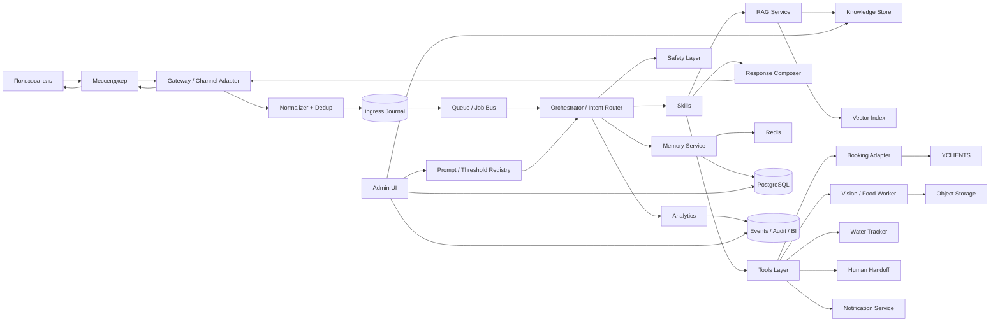
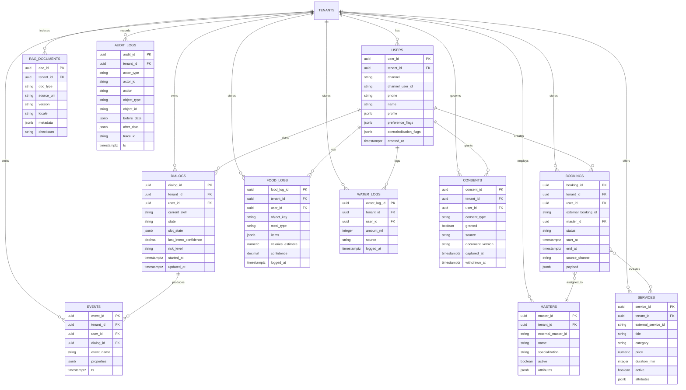
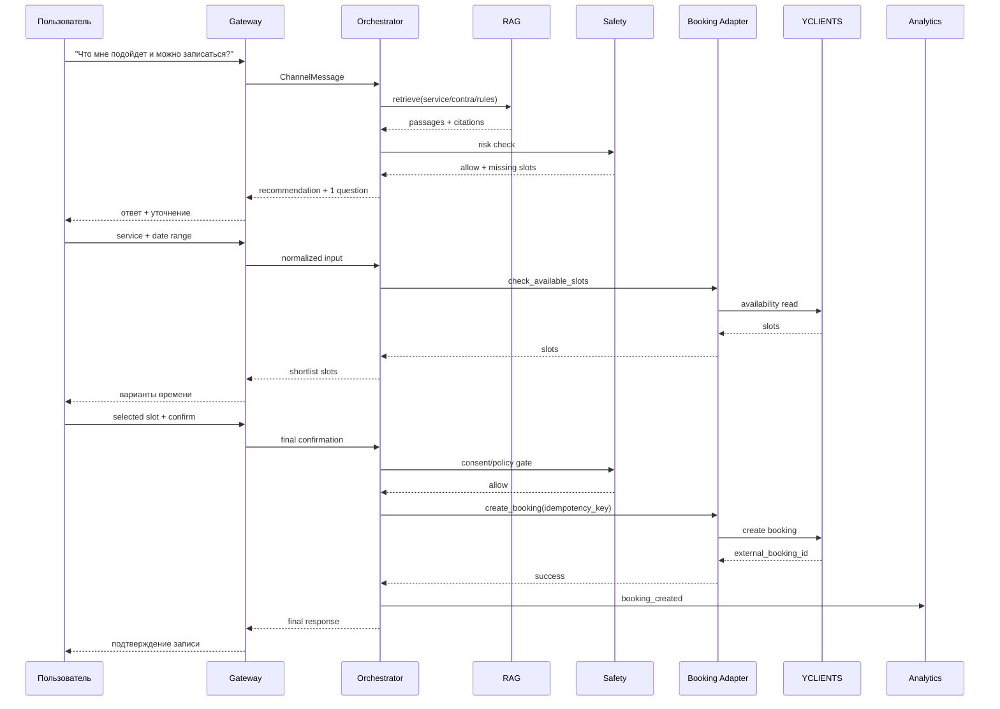
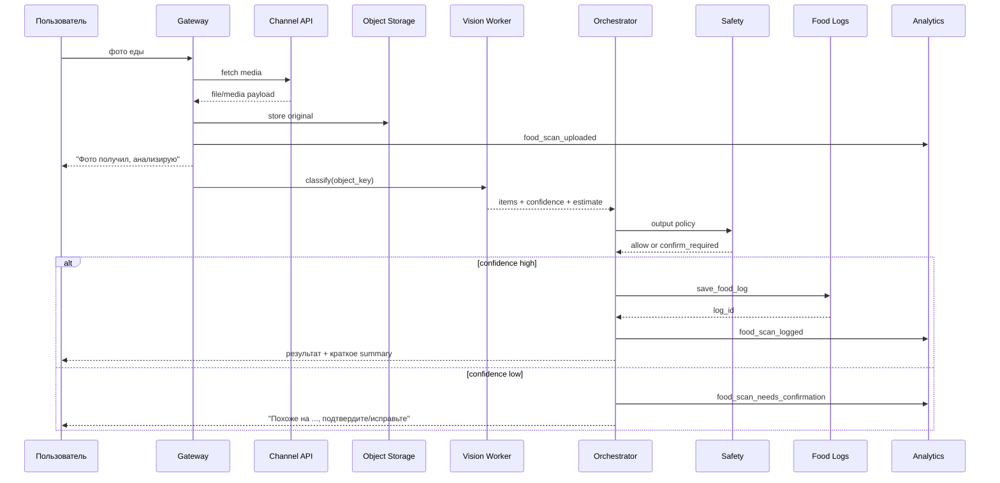
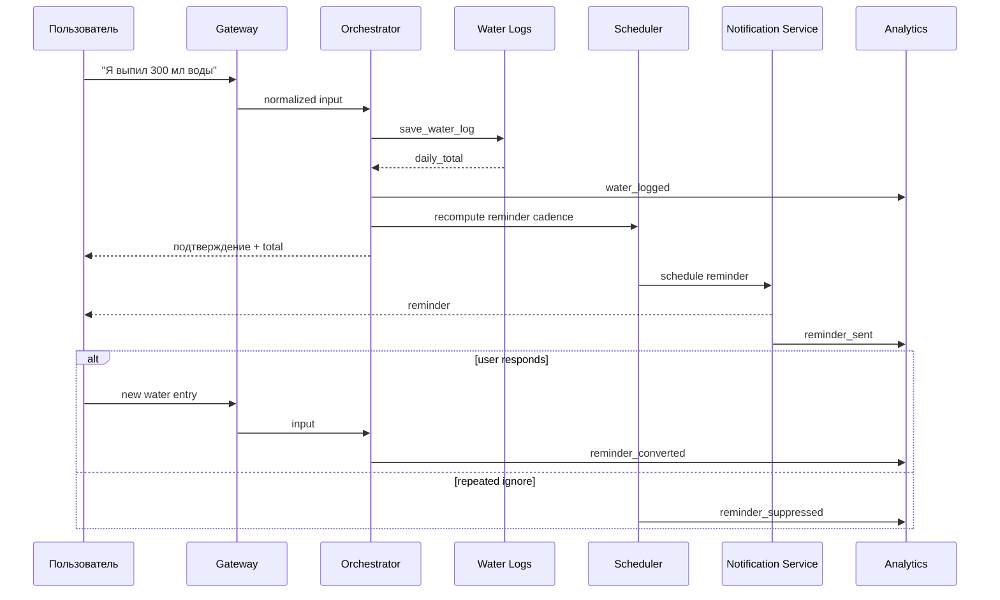
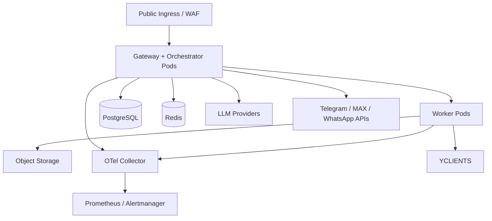

# Инженерная архитектура ИИ-бота для консультации, записи, food scanner и water tracker

## Executive summary

Рекомендуемая целевая архитектура — это не “один большой агент”, а multi-tenant платформа с жёстким разделением на транспорт, оркестрацию, domain skills, deterministic tools, RAG, safety, memory, analytics и admin UI. Такой контур напрямую соответствует вашему каркасу `сообщение → intent → skill → RAG → tool → safety → ответ → лог → память → аналитика` и минимизирует три главных риска: ложные рекомендации, ошибочные side effects при записи и слабую наблюдаемость. Для технической реализации это означает: LLM отвечает только за понимание намерения, извлечение знаний и планирование; все внешние действия идут только через типизированные tool contracts с идемпотентностью, аудитом и retry-политикой приложения. citeturn20view7turn20view8turn9search0turn9search2

Критический внешний constraint — интеграция с urlYCLIENTS API docsturn0search0 и urlYCLIENTS webhooks docsturn15view0. Официальная база знаний YCLIENTS подтверждает, что API даёт доступ к данным клиентов, записей, услуг и другим сущностям через `User token` добавленного пользователя и права системного пользователя; webhook-события по YCLIENTS отправляются один раз, без retry, без гарантии порядка доставки, а успешной доставкой считается любой HTTP-ответ. Из этого следует базовое инженерное правило: webhook-handler обязан быстро валидировать, дедуплицировать, журналировать вход и только потом передавать событие в асинхронную обработку; никакой booking CRUD или LLM прямо в webhook path. citeturn4view0turn16view0turn16view4

Канальный слой тоже нельзя делать “универсальным по умолчанию”. urlTelegram Bot API docsturn0search1 отправляет updates через HTTPS webhook, поддерживает `secret_token` header, а медиа требуют отдельного `getFile`; urlMAX Bot API docsturn1search1 рекомендует только webhook для production, поддерживает `request_contact` и `request_geo_location`, inline keyboard и отдельный upload protocol; urlWhatsApp webhooks docsturn5search4 и urlWhatsApp Media API docsturn5search0 используют webhook + отдельный media fetch/download flow. Следовательно, внутренний ingress должен нормализовать все каналы до единого `ChannelMessage`/`MediaRef`, сохраняя channel-specific особенности только в адаптерах. citeturn10view2turn10view0turn4view4turn4view5turn24view0turn5search4turn5search0turn5search6

Для MVP оптимален стек из entity["software","PostgreSQL","relational database system"] как system of record, entity["software","Redis","in-memory data store"] для short-term state и очередей/стримов, pgvector для tenant-scoped retrieval, object storage с presigned URLs для изображений, stateless app/worker deployment в entity["software","Kubernetes","container orchestration platform"], observability через entity["software","OpenTelemetry","observability framework"] + entity["software","Prometheus","monitoring toolkit"]/entity["software","Alertmanager","alert routing system"] и миграции через entity["software","Alembic","database migration tool"]. Такой набор даёт нужный баланс между транзакционностью, простотой операторки и горизонтальным масштабированием. citeturn20view0turn20view1turn19view0turn11search0turn11search8turn20view5turn20view9turn20view4turn20view2turn20view6

Границы MVP должны быть жёсткими: consultation, FAQ/RAG, сервисный подбор, checks на противопоказания, create/cancel booking, food-scan, water-log, human handoff, consent capture, audit/event logging и базовая админка для KB/prompts/thresholds. Полную автоматизацию reschedule, сложные retention-цепочки и тяжёлую recommend/upsell-логику стоит выносить после стабилизации booking-core, потому что именно на стыке reschedule, предоплат и channel delivery выше всего цена ошибки. У YCLIENTS, например, онлайн-перенос ограничен уже выбранными услугой и сотрудником, а отмена/перенос могут быть ограничены по времени и предоплате; эти ограничения нужно проектировать в skill и tool policy, а не “додумывать” моделью. citeturn13view0turn16view5

## System architecture

Ниже — целевая production-схема. Важный принцип: synchronous ingress path отделён от asynchronous execution path. Это необходимо одновременно из-за one-shot webhooks в YCLIENTS и разной transport semantics у мессенджеров. Telegram и MAX дают webhook-driven транспорт; Telegram требует отдельного `getFile` и ограничивает скачивание ботом размером 20 MB, а ссылка на файл гарантированно живёт не менее часа; MAX требует отдельного upload flow и отдельно предупреждает, что сразу после upload вложение может быть ещё не готово к отправке. WhatsApp Business Platform тоже разделяет webhook events и Media API. citeturn10view0turn4view4turn24view0turn5search4turn5search0



Целевые эксплуатационные границы: webhook ACK — как можно быстрее и без тяжёлой логики; pure-text consultation без внешнего side effect — low-latency synchronous; booking create/cancel — synchronous до результата или controlled fallback; image-heavy food-scan — двухшаговый UX с быстрым ACK и асинхронным результатом. Для MAX это особенно важно, потому что их webhook endpoint должен вернуть HTTP 200 в течение 30 секунд, после чего MAX уже продолжает обработку; для YCLIENTS это ещё важнее, потому что webhook отправляется один раз и без повторной доставки. citeturn4view4turn16view0turn16view4

Таблица ниже фиксирует обязанности компонентов. Она синтезирует исходный каркас проекта и ограничения официальных интеграций. Главная граница ответственности: Gateway знает transport, Orchestrator знает policy и routing, Skills знают domain flow, Tools знают side effects, Safety знает запреты и handoff, Analytics знает факт выполнения. citeturn20view8turn16view0turn10view2turn4view5

| Компонент | Ответственность | Вход | Выход |
|---|---|---|---|
| Gateway / Adapters | Webhook intake, auth, signature/token check, rate limit, media fetch, normalization | webhook/update, media IDs | `ChannelMessage`, `MediaRef`, ACK |
| Normalizer + Dedup | Canonical schema, idempotency keys, raw payload store | adapter output | normalized event |
| Ingress Journal / Queue | Durable buffering, replay, decoupling | normalized event | async jobs |
| Orchestrator / Intent Router | Intent classification, confidence, slot policy, skill selection, fallback | message + session + profile | `SkillPlan`, `ToolPlan`, `ReplyPlan` |
| Skills | Consultation, booking, reschedule/cancel, food-scan, water-tracker, handoff | plan + slots + retrieval/tool results | domain answer or next step |
| RAG Service | Retrieval, filters, rerank, citations | query + tenant/doc filters | top passages + scores |
| Tools Layer | Deterministic reads/writes во внешние системы | typed tool request | typed tool response |
| Memory | Short-term dialog state, long-term profile facts, counters | dialog events | session snapshot, user facts |
| Safety | Policy gate pre/post tool, consent gate, disclaimers, triage | draft/tool plan/profile/risk hints | allow / clarify / block / handoff |
| Analytics / Audit | Event schema, dashboards, audit trail, replay correlation | lifecycle events | KPI, alerting, incident context |
| Admin UI | Управление KB, prompts, thresholds, intent/service mappings, replay | admin actions | published config versions |

## Components and API/tool contracts

### Канальные и внешние интеграции

Интеграционный слой должен быть adapter-based, потому что возможности каналов отличаются не только transport-wise, но и продуктово. У Telegram webhook настраивается через `setWebhook`, можно передать `secret_token`, а webhook delivery может использовать до 100 HTTPS connections; загрузка медиа для бота идёт через `getFile`, а ссылку на скачивание Bot API гарантирует как минимум на 1 час, при этом максимальный размер скачивания ботом — 20 MB. У MAX production должен жить на webhook, а Long Polling прямо помечен как не-подходящий для production; MAX также даёт inline keyboard, `request_contact`, `request_geo_location`, upload до 4 GB и до 10 retry при неуспешной доставке webhook. У WhatsApp webhooks — это JSON HTTP notifications; media скачиваются отдельно через Media API, а интерактивные сообщения поддерживают списки и quick replies. citeturn10view2turn10view0turn4view5turn4view4turn24view0turn12search0turn12search1turn5search4turn5search0turn5search6

Есть одна важная аномалия в документации MAX: общий раздел API говорит, что webhook поддерживает HTTPS, “включая самоподписанные сертификаты”, тогда как страница `POST /subscriptions` пишет, что самоподписанные сертификаты не поддерживаются. Для production-архитектуры безопасная интерпретация одна: использовать публичный CA-сертификат и не рассчитывать на self-signed в проде. citeturn4view5turn4view4

### Tool contracts

Для LLM нужно экспортировать не “сырой API поставщиков”, а ограниченный набор доменных tools. Структура каждого tool request должна быть schema-first: `trace_id`, `tenant_id`, `user_id?`, `channel`, `idempotency_key`, полезная нагрузка и типизированные ошибки. Использование strict structured outputs и function calling позволяет жёстко отделить decision-план от реального side effect и убирает значительную часть ошибочных вызовов. citeturn20view7turn20view8

| Tool | Вход | Успешный ответ | Ошибки | Идемпотентность |
|---|---|---|---|---|
| `search_knowledge` | `tenant_id`, `query`, `skill_scope`, `locale`, `top_k` | passages, citations, retrieval score | `no_results`, `bad_filter` | не нужна |
| `get_service_catalog` | `tenant_id`, `branch_id?`, `category?` | services[] | `upstream_unavailable`, `tenant_not_found` | не нужна |
| `check_available_slots` | `tenant_id`, `service_ids[]`, `master_id?`, `date_range`, `tz` | normalized slots[] | `validation_error`, `timeout`, `upstream_conflict` | по `request_hash` |
| `create_booking` | `tenant_id`, `user_ref`, `service_ids[]`, `master_id`, `start_at`, `consent_pd`, `source_channel` | `booking_id`, `external_booking_id`, `status` | `slot_conflict`, `consent_required`, `upstream_unavailable` | обязательна |
| `reschedule_booking` | `tenant_id`, `booking_ref`, `new_start_at` | updated booking | `booking_not_found`, `window_blocked`, `verification_failed` | обязательна |
| `cancel_booking` | `tenant_id`, `booking_ref`, `reason_code` | cancelled booking | `already_cancelled`, `window_blocked`, `verification_failed` | обязательна |
| `save_food_log` | `tenant_id`, `user_id`, `object_key`, `items`, `confidence`, `confirmed_by_user` | `food_log_id`, nutrition summary | `media_missing`, `low_confidence`, `storage_error` | обязательна |
| `save_water_log` | `tenant_id`, `user_id`, `amount_ml`, `logged_at?` | `water_log_id`, daily total | `validation_error` | обязательна |
| `create_handoff` | `tenant_id`, `dialog_id`, `reason`, `risk_level`, `summary` | `handoff_id`, queue status | `queue_unavailable` | обязательна |
| `send_notification` | `tenant_id`, `user_id`, `channel`, `template_id`, `purpose` | delivery task id | `consent_missing`, `channel_unavailable`, `provider_error` | обязательна |

Для booking-skill нужно учитывать реальные ограничения YCLIENTS. Официальная статья по переносу/отмене онлайн фиксирует, что перенос доступен только в рамках уже выбранных сотрудника и услуги; смена услуги или сотрудника при переносе недоступна. Там же описаны ограничения по времени до визита и опция разрешать/запрещать перенос/отмену предоплаченных записей. Значит, skill `reschedule` нельзя проектировать как “универсальный move”; его правильный вид — “проверить policy, подтвердить допустимость, затем получить новый слот в рамках разрешённой модели, иначе handoff”. citeturn13view0

Для YCLIENTS sync-проекции локальная БД должна подписываться на record webhooks и хранить минимум `resource`, `status`, `resource_id`, `staff_id`, `date`, `visit_id`, `deleted`, а также локальный mapping на пользовательский dialog context. Это позволит нормально обнаруживать out-of-band изменения, отмены администратором и корректно чинить рассинхронизацию. citeturn16view5

## Data model, RAG and prompts

### ER-диаграмма

Транзакционные факты должны жить в relational model, а не в RAG. Для такой системы достаточно PostgreSQL как source of truth: `jsonb` хранит гибкие profile/slot/event payloads, при этом сама СУБД валидирует JSON, а `jsonb` обрабатывается быстрее, чем textual `json`; GIN-индексы позволяют ускорять access patterns по JSONB. Retrieval может жить рядом через pgvector: exact nearest-neighbor — по умолчанию, approximate через HNSW/IVFFlat, где HNSW быстрее по speed-recall tradeoff, а IVFFlat дешевле по памяти и быстрее строится. citeturn20view0turn20view1turn19view0



### RAG-структура

RAG не должен быть “свалкой из PDF и FAQ”. По исходному каркасу и по логике RAG как совмещения parametric и non-parametric memory, KB нужно разделять по tenant, doc_type и policy-critical областям: услуги, противопоказания, подготовка, aftercare, правила записи, FAQ, мастера, legal/consent тексты. Retrieval — filter-first: сначала `tenant_id + locale + doc_type + service_id?`, потом vector recall, потом rerank. Это уменьшает кросс-тенантные ошибки и устаревшие ответы. citeturn9search0turn19view0

```text
/kb/{tenant_id}/
  services/service_{id}.md
  masters/master_{id}.md
  contraindications/general.md
  contraindications/service_{id}.md
  preparation/before_visit.md
  aftercare/after_visit.md
  booking_rules/reschedule_cancel.md
  faq/payments.md
  faq/loyalty.md
  legal/consent_text_{version}.md
  legal/privacy_notice_{version}.md
```

Для memory рекомендован split: short-term memory — текущее состояние диалога, slot filling, последние tool results; long-term memory — только нормализованные, подтверждённые пользователем факты вроде целей, предпочтений, истории визитов, согласий, фактов последних food/water entries и триггеров retention. Это лучше и для product UX, и для data minimization: EDPB подчёркивает, что согласие не легитимизирует сбор лишних данных, а valid consent должно быть freely given, specific, informed, unambiguous и обратимым; YCLIENTS отдельно различает согласие на ПД и рекламные рассылки. citeturn21view2turn18search1turn4view1

### Slot filling, thresholds, fallbacks

| Сценарий | Обязательные слоты | Порог / правило | Fallback |
|---|---|---|---|
| Consultation | `goal`, `body_zone?`, `contra_flags?` | если уверенность роутера ≥ 0.80 — сразу skill | 1 уточняющий вопрос, затем handoff |
| Booking create | `service_ids`, `date_range`, `contact_ref`, `pd_consent`, `explicit_confirm` | side effect только после explicit confirm | shortlist slots → human handoff |
| Reschedule | `booking_ref`, `verification_ref`, `new_date_range` | только если policy разрешает перенос | предложить cancel+new / human |
| Cancel | `booking_ref`, `verification_ref` | policy + verification | human handoff |
| Food scan | `media_ref|object_key` | auto-log только если confidence ≥ 0.65 | ask confirm/edit |
| Water log | `amount_ml` | одношаговый write | correction prompt |
| Handoff | `reason`, `summary` | при risk=`high` или user request | N/A |

Рекомендуемые пороги оркестрации: `intent_confidence >= 0.80` — automatic route; `0.55–0.79` — один clarify turn; `< 0.55` — меню или handoff. Для food-scan — отдельный `classification_confidence >= 0.65` для auto-log. Эти значения не даны внешними API и потому остаются архитектурными стартовыми параметрами, а не нормативом; их нужно калибровать по offline replay и production review. Structured Outputs и function calling подходят для такой конфигурации, потому что гарантируют схему router output и функцию вызова tools. citeturn20view7turn20view8

### Prompt templates

```text
INTENT ROUTER / SYSTEM

Ты — router для wellness-бота.
Верни только JSON по схеме:
{
  "intent": "...",
  "confidence": 0.0,
  "skill": "...",
  "missing_slots": [],
  "needs_rag": true,
  "needs_tool": false,
  "risk_level": "low|medium|high",
  "should_handoff": false,
  "reply_mode": "clarify|answer|tool|handoff"
}

Правила:
- Не выполняй side effects.
- Если запрос связан с услугами/правилами/подготовкой, включай needs_rag=true.
- Если риск medical / противопоказания / боль / беременность / диабет / варикоз, повышай risk_level.
- Если уверенность низкая, reply_mode=clarify.
```

```text
BOOKING SKILL / SYSTEM

Ты — skill записи.
Не создавай запись, пока не собраны обязательные слоты и нет явного подтверждения пользователя.
Перед tool create_booking обязательно проверь:
- service_ids
- slot availability
- contact_ref
- consent_pd
- explicit_confirm=true

Если чего-то не хватает — задай один конкретный вопрос.
Если upstream недоступен — не подтверждай запись, а предложи handoff.
```

```text
FOOD SCAN RESULT / SYSTEM

Ты — ассистент food logging.
Опиши результат как приблизительную оценку.
Если confidence ниже порога, не пиши в лог без подтверждения пользователя.
Формат:
1) что распознано
2) что неуверенно
3) запрос подтверждения или исправления
```

```text
SAFETY CHECKER / SYSTEM

Категории:
- allow
- clarify
- block
- handoff

Блокируй:
- диагнозы
- лечение / лекарства / отмену лекарств
- обещания результата процедуры
- советы при acute symptoms

При high risk:
- не рекомендовать процедуру
- предложить администратора / врача
- добавить нейтральный disclaimer
```

## Prioritized user scenarios and sequence flows

Ниже — компактная матрица сценариев для MVP+1. Она учитывает исходный функциональный набор, ограничения каналов и booking-политики YCLIENTS. Capability-driven UX тоже должен отличаться по каналу: в MAX уместно использовать `request_contact` и `request_geo_location`, в WhatsApp — reply buttons/list, в Telegram — callback buttons и menu shortcuts; для загрузки медиа пути различаются и потому `food_scan` всегда должен опираться на normalized `MediaRef`, а не на channel-native payload. citeturn4view5turn12search0turn12search1turn10view2turn10view0turn24view0turn5search4turn5search0

| Приоритет | Intent / сценарий | Слоты | Критерий успеха | Failure modes | Risk | Короткий диалог | Интеграции | Записи в БД | Events |
|---|---|---|---|---|---|---|---|---|---|
| P0 | consultation_recommend_service | `goal`, `body_zone?`, `contra_flags?` | дана безопасная рекомендация или уточняющий вопрос | low confidence, no KB hit, contra-risk | Med | U: «Что мне подойдёт?» → B: «Какая цель и есть ли противопоказания?» → U → B: рекомендация | RAG, Safety | dialogs, events, memory(profile facts) | `consultation_started`, `recommendation_shown` |
| P0 | faq_service_info | `faq_topic` | дан factual answer с цитатами из KB | no_results, stale KB | Low | U: «Сколько длится?» → B: ответ | RAG | dialogs, events | `faq_answered` |
| P1 | booking_create | `service_ids`, `date_range`, `contact_ref`, `pd_consent`, `explicit_confirm` | создана запись или handoff с полным контекстом | slot conflict, upstream fail, missing consent | Med | U: «Запиши на массаж завтра» → B: слоты → U: выбран слот → B: подтверждение | YCLIENTS, Notifications | bookings, dialogs, consents, audit_logs, events | `booking_slots_shown`, `booking_created`, `booking_failed` |
| P1 | booking_reschedule | `booking_ref`, `verification_ref`, `new_date_range` | запись перенесена в рамках policy | rule blocked, old booking not found | Med | U: «Перенеси запись» → B: идентификация → B: новые слоты | YCLIENTS | bookings, audit_logs, events | `booking_reschedule_started`, `booking_rescheduled`, `handoff_created` |
| P1 | booking_cancel | `booking_ref`, `verification_ref` | запись отменена | rule blocked, already cancelled | Low/Med | U: «Отмени» → B: какая запись? → U → B: подтверждение | YCLIENTS | bookings, audit_logs, events | `booking_cancelled` |
| P1 | food_scan | `media_ref` | фото классифицировано и лог сохранён или подтверждение запрошено | media fetch fail, low confidence | Low/Med | U: фото → B: «анализирую» → B: «похоже на…, подтвердите» | media fetch, object storage, vision worker | food_logs, dialogs, events | `food_scan_uploaded`, `food_scan_logged`, `food_scan_needs_confirmation` |
| P1 | water_log | `amount_ml` | вода записана, total shown | invalid amount | Low | U: «300 мл воды» → B: «записал, сегодня 1100 мл» | none / scheduler | water_logs, events | `water_logged` |
| P1 | human_handoff | `reason`, `summary` | человек получил task с контекстом | queue down | High | U: «Соедините с администратором» → B: handoff | admin queue | handoff task, events, audit | `handoff_created`, `handoff_resolved` |
| P2 | retention_nudge | `purpose`, `cadence`, `consent_status` | отправлен reminder и измерен uplift | consent missing, channel blocked | Low | B: reminder → U: response/no response | notifications, analytics | events | `reminder_scheduled`, `reminder_sent`, `reminder_converted` |

### Consultation to booking

Этот сценарий должен иметь две раздельные фазы: консультация и transactional booking. Первая использует RAG и safety; вторая — только tools и explicit confirmation. Это следует и из общих best practices tool-using LLM, и из практики YCLIENTS, где политика отмены/переноса и состояние записи остаются внешней истиной. citeturn20view8turn13view0turn16view5



### Food-scan image to classification to log



### Water-entry to reminder



## Safety, analytics and operations

### Safety and consent policy

В этом продукте safety должен стоять не “после генерации текста”, а в двух местах: `policy-at-plan` перед tool side effects и `policy-at-reply` перед отправкой ответа. Причина проста: бот связан и с эстетическими/телесными темами, и с питанием, и с записью. Поэтому triage нужен формализованный: `low` — обычный ответ, `medium` — уточнение/мягкий disclaimer, `high` — handoff или рекомендация обратиться к врачу, без подбора процедуры. YCLIENTS официально разделяет два типа согласий — на обработку персональных данных и на информационно-рекламные рассылки; автоматические уведомления требуют согласия на обработку ПД, рекламные — оба согласия. Для GDPR/EU кейсов valid consent должно быть freely given, specific, informed, unambiguous и легко отзываемым. citeturn4view1turn21view2turn18search1

```text
Минимальная safety-policy

LOW
- FAQ, прайс, правила записи, подготовка, aftercare, вода, food-log

MEDIUM
- неполные противопоказания
- конфликтующие данные профиля
- низкая уверенность food-scan
- повторные tool errors

HIGH
- диагностика, лечение, лекарства
- острая боль, воспаление, кровотечение, температура
- беременность + спорная процедура
- варикоз/диабет/онкология/повреждение кожи, если правило не покрыто достоверно
- явный запрос на человека
```

Consent capture должен быть first-class сущностью. Для YCLIENTS это подтверждается наличием отдельных чекбоксов и в карточке клиента, и в онлайновой записи, а также различием между автоматическими и рекламными уведомлениями. Для платформенной архитектуры это означает: хранить `consent_type`, `source`, `document_version`, `captured_at`, `withdrawn_at`, `purpose`; нерелевантные outbound messages не отправлять вовсе. Если обработка строится на consent, то место capture должно быть рядом с местом действия, как рекомендует EDPB. citeturn4view1turn18search12turn21view2

### Analytics and event schema

Product analytics лучше строить от canonical internal event model, а не от одного внешнего вендора. Mixpanel требует минимум `Event Name`, `Timestamp`, `Distinct ID`; GA4 различает автоматически собираемые, recommended и custom events, а критичные для бизнеса события можно помечать как key events. Поэтому практический путь — единый внутренний event envelope и fan-out в Mixpanel/GA4/warehouse по необходимости. citeturn20view10turn21view0turn21view1

```json
{
  "event_name": "booking_created",
  "timestamp": "2026-05-09T08:15:23Z",
  "distinct_id": "tenant_42:user_1001",
  "tenant_id": "tenant_42",
  "user_id": "user_1001",
  "dialog_id": "dlg_9f13",
  "channel": "telegram",
  "intent": "booking_create",
  "skill": "booking",
  "tool_name": "create_booking",
  "result": "success",
  "latency_ms": 1820,
  "rag_hit": true,
  "safety_decision": "allow",
  "booking_id": "bk_123",
  "experiment": "router_threshold_v2"
}
```

| Метрика | Определение | Где использовать |
|---|---|---|
| Conversion to booking | `booking_created / booking_slots_shown` | коммерческая воронка |
| Consultation usefulness | `recommendation_shown / consultation_started` | качество консультации |
| Booking error rate | `booking_failed / booking_attempted` | надёжность интеграции |
| Handoff rate | `handoff_created / dialogs` | safety/coverage баланс |
| Food confirmation rate | `food_scan_logged / food_scan_uploaded` | качество food-scan |
| Water D7 retention | `users with log on D7 / users first log on D0` | stickiness |
| NPS / CSAT | survey-based | perception |
| p95 latency by skill | percentile latency | capacity planning |
| Duplicate side effects | duplicate create/cancel/reschedule | идемпотентность |

### Monitoring, incidents, migrations, CI/CD

Для observability нужен единый trace across ingress → routing → tool → outbound. OpenTelemetry формально разделяет traces, metrics и logs; Alertmanager берёт на себя dedup/group/route/silence alerting. Практически это значит: каждый inbound event и every tool call получают `trace_id`, а P1-инциденты определяются по симптомам, а не по низкоуровневым причинам: booking create failure spike, duplicate booking spike, consent gate bypass, outbound outage, queue lag, image backlog. citeturn20view9turn20view4turn8search21

Схемы БД и релизы нужно вести через versioned migrations. Alembic предназначен именно для schema migration в проектах на SQLAlchemy; GitHub Actions подходит как базовый CI/CD слой для build/test/deploy pipeline. Практическая процедура для prod: `expand → backfill → switch → contract`, без destructive changes в том же релизе, что и код, и с отдельным migration smoke-test в staging. citeturn20view2turn8search13turn8search2turn8search5

Минимальный набор автоматизированных тестов:

| Тип теста | Что ловит |
|---|---|
| Unit | router rules, slot logic, policy branches |
| Contract | YCLIENTS/MAX/Telegram/WhatsApp adapter compatibility |
| Prompt regression | drift в router/skill/safety outputs |
| Fixture replay | реальные webhook/media payloads |
| Integration | DB + queue + object storage + tools |
| Load / soak | p95/p99 latency, backlog growth |
| Chaos / failover | upstream timeout, duplicate delivery, queue outage |
| Safety review set | false allow / false block |

## MVP, technologies and deployment

### MVP scope

MVP должен закрывать полный жизненный цикл “спросил → получил безопасный ответ → при желании записался → оставил след в памяти и аналитике”. Всё, что не усиливает этот замкнутый контур, можно смело отложить. YCLIENTS уже даёт API-доступ к клиентам/записям/услугам, webhooks и механики consent/online booking; канал MAX даёт production-ready webhook модель и UX-кнопки; WhatsApp и Telegram — зрелые webhook/media transport. Этого достаточно, чтобы собрать production MVP без лишней платформенной сложности. citeturn4view0turn16view0turn4view1turn4view5turn10view2turn5search4

| Scope | Приоритет | Итог | Трудоёмкость |
|---|---|---|---|
| Gateway + normalization + dedup | P0 | стабильный ingress | не указано |
| Orchestrator + router + slot state | P0 | управляемый execution graph | не указано |
| Consultation skill + RAG + citations | P0 | полезные ответы | не указано |
| Safety layer + disclaimers + handoff | P0 | контролируемый риск | не указано |
| Consent capture + consent model | P0 | законный outbound и storage | не указано |
| Analytics + audit + dashboards | P0 | измеримость и расследование | не указано |
| Booking availability + create + cancel | P1 | коммерческий MVP | не указано |
| Food scanner + image pipeline | P1 | wellness-log loop | не указано |
| Water tracker + reminders | P1 | retention loop | не указано |
| Automated reschedule | P2 | меньше нагрузки на админа | не указано |
| Admin UI self-service | P2 | быстрые изменения без релиза | не указано |
| Campaigns / experiments / segmentation | P2 | рост retention/conversion | не указано |

### Технологический выбор

Рекомендуемый стек:

| Слой | Рекомендация | Почему |
|---|---|---|
| OLTP DB | PostgreSQL + JSONB | транзакции + гибкие JSON-поля + индексы |
| Retrieval | pgvector | один operational контур, exact + HNSW/IVFFlat |
| Session / state | Redis | быстрый short-term state, streams, атомарные операции |
| Queue | Redis Streams или отдельный broker | async ingestion/execution, DLQ/replay |
| Media | S3-compatible object storage | дешёвое хранение, presigned upload/download |
| App runtime | stateless containers | простое горизонтальное масштабирование |
| Orchestration | Kubernetes | HPA и rolling/canary deployment |
| LLM router | дешёвая текстовая модель со structured outputs | экономичный routing |
| LLM generator | более сильная текстовая модель | консультация и answer synthesis |
| Vision | vision-capable model/worker | food-scan |
| Observability | OpenTelemetry + Prometheus + Alertmanager | traces/metrics/logs + alert routing |
| Migrations | Alembic | versioned DB changes |
| CI/CD | GitHub Actions или эквивалент | стандартный pipeline |

Эти рекомендации опираются на официальные свойства инструментов: PostgreSQL `jsonb` быстрее для обработки и поддерживает JSON operators; pgvector поддерживает exact search и approximate HNSW/IVFFlat; Redis Streams — append-only event structure с persisted delivery semantics лучше обычного pub/sub; HPA в Kubernetes масштабирует workload по наблюдаемым метрикам; presigned URLs в S3 дают time-limited upload без выдачи прямых bucket permissions. citeturn20view0turn19view0turn11search8turn20view5turn20view6

### Deployment pattern

Рекомендуемый deployment pattern — cloud-agnostic, но с обязательными логическими зонами:



Практические требования к deployment: stateless app pods, отдельные worker pools под booking и media, read/write secrets через secret manager, immutable config versions, canary release для prompt/threshold updates, отдельный replay tool для webhook fixtures, резервирование queue backlog и чёткий DLQ. Для MAX отдельно контролируйте 30 rps ceiling и webhook timeout; для WhatsApp учитывайте, что webhook delivery может ретраиться до 7 дней, а для YCLIENTS — наоборот, retry нет вовсе. citeturn24view0turn4view4turn5search9turn16view0

## Open questions and limitations

Подробные route-level спецификации YCLIENTS developer portal публично индексируются ограниченно; support-статьи подтверждают сам факт API-доступа, webhook semantics, user token, consent и online booking rules, но точные route names, rate limits и payload schemas по всем CRUD-операциям в этом отчёте оставлены как `не указано` и должны быть уточнены на этапе интеграции в developer portal. citeturn4view0turn16view0turn13view0

Документация MAX внутренне противоречива по вопросу self-signed сертификатов для webhook. Для production нужно считать поддерживаемым только публичный CA certificate, пока команда не проверит это в стенде. citeturn4view4turn4view5

Для food-scan и memory/storage policies периоды хранения raw media, derived nutrition logs, audit logs и reminder history в исходных требованиях не указаны, поэтому retention policy, legal basis by purpose и data residency matrix здесь оставлены как `не указано` и должны быть утверждены отдельно вместе с privacy/compliance требованиями конкретного рынка. citeturn21view2turn18search1turn4view1