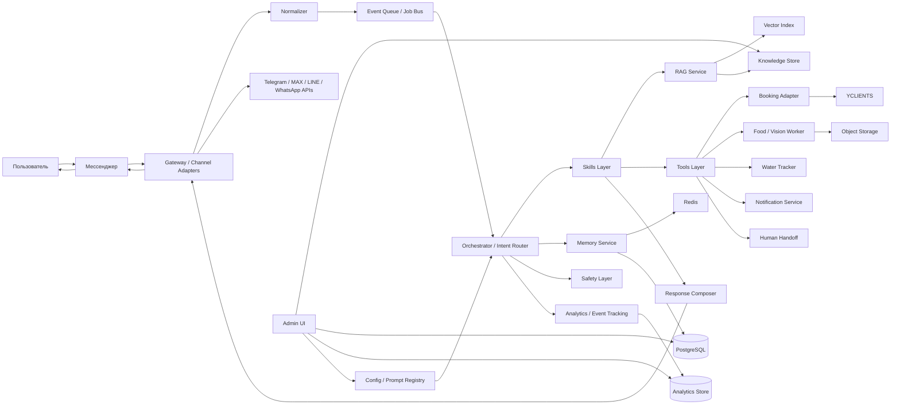
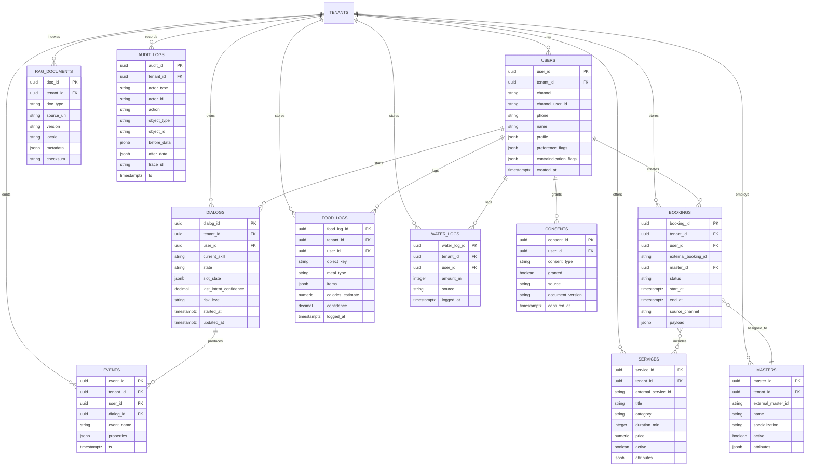
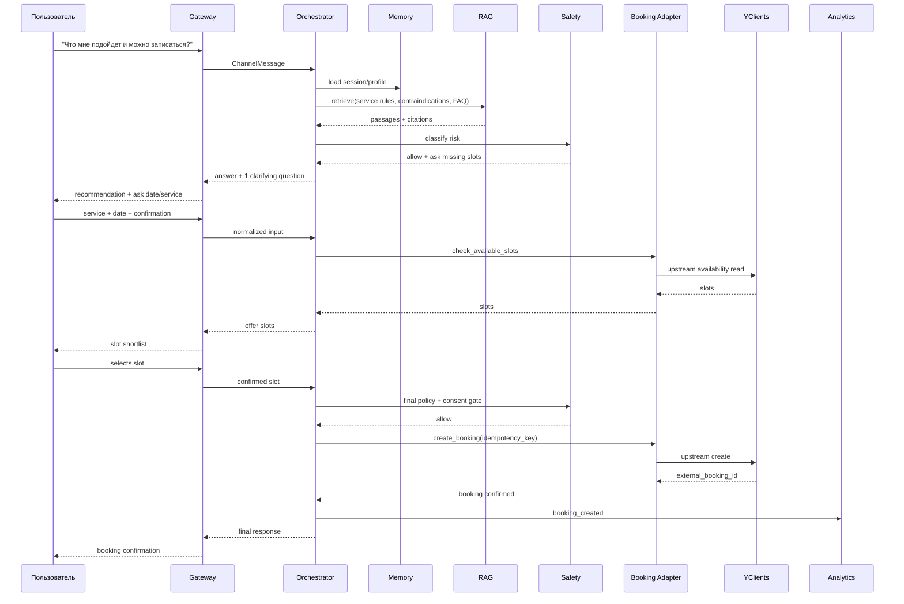
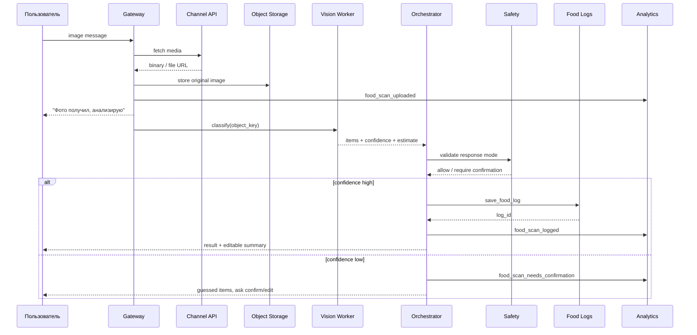
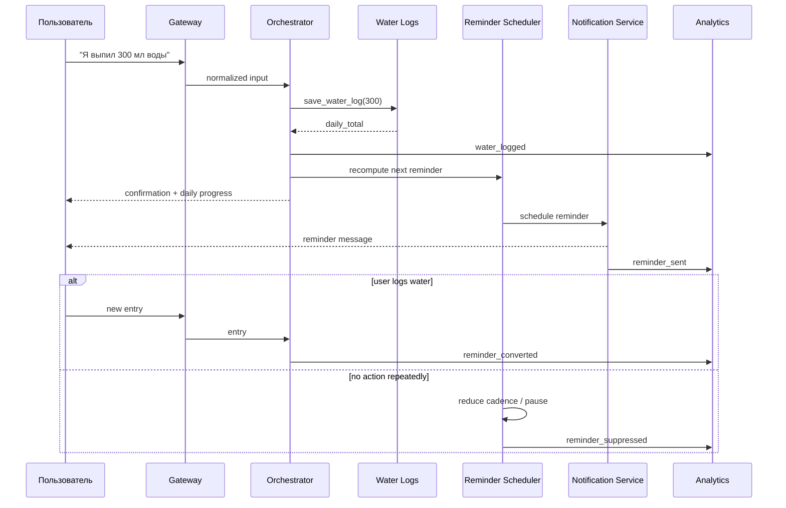

# Архитектура ИИ-бота для консультации, записи и wellness-tracking

## Executive summary

Оптимальная целевая форма для этого продукта — не один “умный промпт”, а multi-tenant платформа с единым ingress/gateway, отдельным orchestrator/router, изолированными skills, детерминированным tools-layer и обязательными слоями safety, memory, analytics и admin UI. Это точно соответствует вашему каркасу message→intent→skill→RAG→tool→safety→response→log→memory→analytics и идее разделять консультацию, запись, аналитические действия и память, а не пытаться решить всё одним агентом. fileciteturn0file0L1-L118 fileciteturn0file1L7-L70 fileciteturn0file1L98-L189

Самый жёсткий внешний constraint — booking-интеграция. У urlYCLIENTSturn2search1 доступ к API строится через user token и права системного пользователя; официальная база знаний прямо указывает, что API используется для данных клиентов, записей, услуг и других сущностей. Для событийной синхронизации у платформы есть официальные webhook-уведомления по клиентам, услугам, сотрудникам, записям и другим объектам, но без retry и без гарантии порядка доставки; платформа считает webhook “доставленным”, если получила любой HTTP-ответ. Отсюда главный инженерный вывод: webhook-handler не должен делать LLM, booking CRUD или бизнес-логику до сохранения события в durable journal/queue. citeturn3view3turn21view4

Мессенджерный слой должен быть adapter-based, потому что transport semantics различаются. urlTelegram Bot APIturn0search2 использует HTTPS webhooks, secret token в заголовке и отдельный getFile/download flow для медиа; urlMAX APIturn30search1 рекомендует webhook для production, поддерживает secret header, deep links, inline keyboard, request_contact/request_geo_location и отдельный upload protocol; urlLINE Messaging APIturn0search17 отправляет события в webhook и требует отдельного запроса за content по message ID; urlWhatsApp Cloud APIturn11search9 использует webhooks для входящих сообщений и статусов и поддерживает text, rich media и interactive messages. Это означает, что внутренний интерфейс gateway должен нормализовать все каналы до одного `ChannelMessage`/`MediaRef`, а channel-specific детали держать только в адаптерах. citeturn10view0turn10view1turn10view2turn30search2turn30search4turn30search5turn31search0turn31search1turn3view8turn11search4turn11search2turn11search9

Для MVP достаточно stateless app-сервисов в контейнерах, PostgreSQL+JSONB как system of record, Redis для session/state и асинхронной обработки, pgvector для tenant-scoped retrieval, object storage с presigned URLs для food images, и observability через OpenTelemetry, Prometheus/Alertmanager и error tracking. Это даёт хорошую комбинацию транзакционности, невысокой операционной сложности и масштабируемости: Kubernetes HPA покрывает horizontal scale stateless-слоя; PostgreSQL JSONB и GIN подходят для смешанной relational/document нагрузки; pgvector даёт exact search и ANN через HNSW/IVFFlat; Redis Streams и transactions подходят для orchestration-state и worker backpressure. citeturn14search0turn14search12turn13search0turn13search4turn13search2turn13search10turn28search0turn28search1turn15search2turn15search10turn9search3turn13search3turn14search3

MVP стоит ограничить консультацией, FAQ/RAG, подбором услуги, чтением доступности, созданием/отменой записи, food-scan, water-log, consent capture, human handoff и сквозной аналитикой. Полную автоматизацию reschedule, сложные кампании, multi-step upsell и продвинутый recommendation engine лучше вынести после стабилизации booking-core и safety/observability, потому что цена ошибки именно там максимальна. fileciteturn0file1L248-L295 citeturn21view4turn23view4

## Целевая архитектура

Архитектурный принцип должен быть таким: probabilistic слой отвечает за понимание и планирование, deterministic слой — за факты и side effects. Это согласуется и с вашим каркасом, и с современными паттернами tool-using/RAG систем: RAG добавляет non-parametric memory и provenance, ReAct и Toolformer показывают практическую ценность явного выбора действий/инструментов, а schema-constrained tool calling снижает двусмысленность при выборе skill и tool. fileciteturn0file0L1-L118 citeturn17search0turn16search2turn16search3turn15search3turn15search7turn15search19

Диаграмма ниже фиксирует рекомендованный production-контур. В ней умышленно разделены synchronous ingress path и asynchronous execution path: это критично, потому что booking-platform webhooks приходят без retry и без ordering guarantees, а мессенджеры, наоборот, могут повторно доставлять или запрашивать отдельное скачивание медиа. citeturn21view4turn10view0turn10view1turn3view8turn30search4turn30search5



Рекомендуемые эксплуатационные границы для этого контура: ACK webhook ≤ 150–300 мс; pure text consultation без tool-side effects — p95 до 2–3 секунд; booking read/create flow — p95 до 5–8 секунд; food-scan — двухшаговый UX, где первичный ACK мгновенный, а финальный результат идёт асинхронно после vision worker. Иначе вы получите неустойчивость на media-heavy запросах и ненужные потери событий. citeturn21view4turn10view1turn30search5

| Компонент | Роль | Основные входы | Основные выходы |
|---|---|---|---|
| Gateway | Приём webhook/update, авторизация канала, rate limit, нормализация транспорта | Channel update, media callback | `ChannelMessage`, `MediaRef`, ACK |
| Orchestrator / Intent Router | Классификация intent, выбор skill, решение нужен ли RAG/tool/handoff | Нормализованное сообщение, session state | `SkillPlan`, `ToolPlan`, `ResponsePlan` |
| Skills Layer | Domain-логика: consultation, booking, reschedule/cancel, food, water, handoff | `SkillPlan`, slots, профиль | Уточнения, tool requests, answer draft |
| RAG Service | Tenant-scoped retrieval, rerank, citations | Query + metadata filters | Passages, sources, retrieval confidence |
| Tools Layer | Детерминированные побочные действия | Tool request + idempotency key | Tool result, domain error |
| Memory Service | Short-term state, long-term profile, behavioural aggregates | Dialog events | Session snapshot, profile facts, counters |
| Safety Layer | Policy check, consent gate, disclaimer/handoff, output rewrite | Draft answer, tool plan, risk hints | allow / revise / block / handoff |
| Analytics | Event schema, KPI, experiments, audit correlation | All major lifecycle events | Dashboards, alerts, exports |
| Admin UI | Управление KB/prompts, mappings, thresholds, replay, overrides | Admin actions | Версии конфигурации, публикация, rollback |

Эта декомпозиция важна не только для масштабируемости, но и для тестируемости: router, skills, tool adapters, safety и notifier можно гонять независимо на golden fixtures, в то время как один большой агент почти не поддаётся безопасной регрессии. fileciteturn0file1L98-L189 citeturn14search2

## Компоненты и API-контракты

Все внутренние side-effect APIs рекомендую делать schema-first: один request envelope, единый `trace_id`, обязательный `tenant_id`, `channel_message_id`, `idempotency_key`, типизированные ошибки и явный флаг `retryable`. Для этого хорошо подходят strict JSON-schema outputs/tool calling: LLM должен возвращать план, а не “выполнять” операторскую команду текстом. Идемпотентность здесь не optional: у части каналов возможны redelivery/retry, а входящие внешние события могут приходить без порядка доставки. citeturn15search3turn15search7turn10view0turn30search4turn21view4

| Tool / API | Вход | Успешный ответ | Типовые ошибки | Идемпотентность |
|---|---|---|---|---|
| `search_knowledge` | `tenant_id`, `query`, `skill_scope`, `locale`, `top_k` | passages + citations + retrieval score | `no_results`, `bad_filter` | не нужна |
| `get_service_catalog` | `tenant_id`, `branch_id?`, `category?` | services[] | `tenant_not_found`, `upstream_unavailable` | не нужна |
| `check_available_slots` | `tenant_id`, `service_ids[]`, `master_id?`, `date_range`, `tz` | normalized slots[] | `validation_error`, `upstream_timeout` | по `request_hash` |
| `create_booking` | `tenant_id`, user/client payload, `service_ids[]`, `master_id`, `start_at`, `consent_pd`, `source_channel` | `booking_id`, `external_booking_id`, `status=confirmed|pending` | `slot_conflict`, `consent_required`, `upstream_unavailable` | обязательна |
| `reschedule_booking` | `tenant_id`, `booking_id`, `new_start_at`, `new_master_id?` | updated booking | `booking_not_found`, `conflict`, `verification_failed` | обязательна |
| `cancel_booking` | `tenant_id`, `booking_id`, `reason_code`, `verified_user_ref` | cancelled booking | `booking_not_found`, `already_cancelled` | обязательна |
| `save_food_log` | `tenant_id`, `user_id`, `media_ref|object_key`, classification, `confirmed_by_user` | `food_log_id`, nutrition summary | `media_expired`, `low_confidence`, `storage_error` | обязательна |
| `save_water_log` | `tenant_id`, `user_id`, `amount_ml`, `logged_at?` | `water_log_id`, daily total | `validation_error` | обязательна |
| `create_handoff` | `tenant_id`, `dialog_id`, `reason`, `risk_level`, `summary` | `handoff_id`, queue status | `queue_unavailable` | обязательна |
| `send_notification` | `tenant_id`, `user_id`, `channel`, `template_id`, `purpose` | delivery task id | `consent_missing`, `channel_blocked`, `provider_error` | обязательна |

Для booking-adapter не надо экспортировать в LLM всю внешнюю API-поверхность. Модели достаточно 5–7 доменных операций вроде `get_service_catalog`, `check_available_slots`, `create_booking`, `reschedule_booking`, `cancel_booking`, `get_booking_status`. Upstream mapping фиксируется уже в интеграции: в официальной документации booking-платформы есть доступ к API для клиентов/записей/услуг и документированы как минимум получение/удаление записей пользователя, CRUD по услугам и webhook payload для record с полями `id`, `location_id`, `staff_id`, `date`, `visit_id`, `deleted`. citeturn3view3turn26search0turn25search0turn21view1

Отдельно рекомендую сделать `Notification Service` не “частью бота”, а самостоятельным сервисом с purpose-based dispatch: informational reminders, transactional booking messages и advertising/marketing идут разными политиками и consent checks. Это особенно важно, потому что сама booking-платформа различает автоматические и рекламные уведомления и привязывает их к разным видам согласия. citeturn23view4

## Данные, RAG и prompting

Source of truth должен быть разделён на три класса. Транзакционные факты — каталог услуг, сотрудники, брони, согласия, события — живут в relational store. Объясняющее знание — FAQ, подготовка к визиту, противопоказания, aftercare, тексты услуг, правила записи — живёт в RAG. Эфемерное состояние диалога и rate/state для оркестрации — в fast store. Это соответствует идее RAG как комбинации parametric и non-parametric memory, но не превращает RAG в источник транзакционной истины. Цены, слоты, мастер, статус брони и consent status всегда читаются только из deterministic sources. citeturn17search0turn13search0turn13search4turn13search2turn13search10turn28search0turn28search1

Диаграмма ниже покрывает обязательные сущности из вашего запроса и добавляет то, без чего production-версия обычно ломается: `tenants`, `consents`, `rag_documents`, `audit_logs`. fileciteturn0file1L111-L189



| Таблица | Минимальные поля | Назначение |
|---|---|---|
| `users` | `tenant_id`, `channel`, `channel_user_id`, `phone`, `profile`, `contraindication_flags` | Профиль пользователя и self-disclosed факты |
| `dialogs` | `current_skill`, `state`, `slot_state`, `last_intent_confidence`, `risk_level` | Оркестрация и short-term memory |
| `bookings` | `external_booking_id`, `status`, `start_at`, `source_channel`, `payload` | Локальная проекция записи и источник аудита |
| `services` | `external_service_id`, `duration_min`, `price`, `attributes` | Детерминированный каталог |
| `masters` | `external_master_id`, `specialization`, `attributes` | Каталог сотрудников |
| `food_logs` | `object_key`, `items`, `calories_estimate`, `confidence` | Лог питания и image-based classification |
| `water_logs` | `amount_ml`, `logged_at`, `source` | Лог воды |
| `events` | `event_name`, `properties`, `ts` | Продуктовая аналитика и KPI |
| `consents` | `consent_type`, `granted`, `source`, `document_version`, `captured_at` | Юридический след согласий |
| `rag_documents` | `doc_type`, `source_uri`, `version`, `metadata`, `checksum` | Версионируемая KB |
| `audit_logs` | `actor_*`, `action`, `before_data`, `after_data`, `trace_id` | Невыбрасываемый аудит side effects |

Для PII, consent и изображений рекомендую цельно хранить не только факт, но и цель обработки (`purpose`), версию документа, источник согласия и уровень редактирования/маскирования. Raw media лучше держать вне business DB в object storage с time-limited access и soft-delete policy, а в PostgreSQL хранить только ссылку, hash и derived metadata. citeturn15search2turn15search10turn23view1turn9search6turn19search3

RAG-корпус стоит организовать по tenant и по типу знания, а не по “одной папке на всё”. Для этой системы минимальная структура может быть такой. Ровно потому, что запись, противопоказания и aftercare имеют разный жизненный цикл, их нельзя смешивать в одном документе или только в prompt text. fileciteturn0file1L111-L189 citeturn17search0turn3view3

```text
/kb/{tenant_id}/
  services/
    service_{id}.md
  pricing/
    price_policy_{version}.md
  masters/
    master_{id}.md
  contraindications/
    general.md
    service_{id}.md
  preparation/
    before_visit.md
  aftercare/
    after_visit.md
  booking_rules/
    reschedule_cancel.md
    deposits.md
  faq/
    payments.md
    loyalty.md
    gift_cards.md
  legal/
    consent_text_{version}.md
    privacy_notice_{version}.md
```

Для каждого chunk нужны как минимум `tenant_id`, `doc_type`, `service_id?`, `master_id?`, `locale`, `version`, `effective_from`, `source_uri`, `approved_by`, `approval_status`. Retrieval должен быть filter-first: сначала tenant/locale/doc_type/service_id, потом vector retrieval, потом rerank. Иначе бот начнёт “галлюцинировать” ценами и противопоказаниями из чужого салона или старой версии документа. citeturn17search0turn13search2turn13search10

| Сценарий | Обязательные слоты | Правило завершения | Fallback |
|---|---|---|---|
| Consultation | `goal`, `body_zone?`, `contra_flags?` | answer draft + citations + safety allow | handoff при medical risk |
| Booking create | `service_ids`, `desired_date/time_or_range`, `contact_ref`, `pd_consent` | explicit user confirmation + successful tool result | shortlist slots / human |
| Reschedule | `booking_ref`, `verification_ref`, `new_date/time` | updated booking | show matching bookings / human |
| Cancel | `booking_ref`, `verification_ref`, `reason?` | cancel success | show matching bookings / human |
| Food scan | `media_ref or object_key` | classification >= threshold or user confirms | manual entry |
| Water log | `amount_ml` | write log success | one-step correction |

Рекомендуемые пороги: `intent_confidence >= 0.80` — route automatically; `0.55–0.79` — задать один уточняющий вопрос; `< 0.55` — fallback меню/оператор. Для food-scan имеет смысл отдельный порог `classification_confidence < 0.65` → не писать в лог без пользовательского подтверждения. Это снижает ложные записи и сохраняет UX компактным. fileciteturn0file1L248-L295

Для router/tool planner лучше использовать строго типизированный JSON-вывод. Ниже — минимальные шаблоны, которых уже достаточно, чтобы команда разработки собрала prompt registry и regression set. Поддержка structured outputs через function calling / JSON schema в современных LLM APIs делает такой контракт практичным, а не “бумажным”. citeturn15search3turn15search7turn15search19

```text
INTENT ROUTER SYSTEM

Ты — router для wellness-бота.
Верни только JSON по схеме:
{
  "intent": "...",
  "confidence": 0.0,
  "skill": "...",
  "missing_slots": [],
  "needs_rag": true,
  "needs_tool": false,
  "risk_level": "low|medium|high",
  "should_handoff": false,
  "reply_mode": "clarify|answer|tool|handoff"
}

Правила:
- Не создавай booking side effect.
- Если запрос похож на medical advice, повышай risk_level.
- Если intent неясен, выбирай clarify.
- Если нужен factual answer о правилах/услугах/подготовке, ставь needs_rag=true.
```

```text
CONSULTATION SKILL SYSTEM

Ты — ассистент сервиса wellness/beauty.
Используй ТОЛЬКО retrieval passages и profile facts.
Не обещай медицинский эффект.
Если данных недостаточно — задай 1 уточняющий вопрос.
Если есть risk_level=high, не рекомендуй услугу, а переведи в handoff.

Формат ответа:
1) краткий вывод
2) почему
3) если уместно — следующий безопасный шаг
4) citation ids
```

```text
SAFETY CHECKER POLICY SNIPPET

- Запрещено диагностировать, назначать лечение, лекарства или отмену лекарств.
- При беременности, варикозе, диабете, боли, воспалении, повреждении кожи, кровотечении, температуре, выраженном отеке:
  answer_mode = handoff_or_doctor
- Запись разрешена только после explicit confirmation пользователя.
- Сохранение персональных данных и outbound notifications — только при наличии релевантного consent.
- Оценки по food-scan всегда помечать как approximate.
```

## Ключевые сценарии

Ниже — три основных sequence flow. Во всех трёх сделаны одинаковые системные акценты: сначала normalization и state, потом retrieval/tooling, затем safety, потом side effect, и в конце — analytics/audit. Это и есть правильная operationalization вашего исходного каркаса. fileciteturn0file1L7-L70 citeturn15search7turn17search0

### Consultation to booking

Консультационный сценарий должен отделять “пояснение / подбор” от “создания записи”. Объяснение строится из RAG+catalog, а side effect появляется только после заполнения обязательных slots, consent check и финального explicit confirmation. citeturn17search0turn3view3turn23view1



Если upstream недоступен, не стоит “притворяться” записью. Правильный fallback — `pending_booking` + handoff task для администратора с полной context card: service, preferred slots, user identity, risk flags, last messages. Это снижает cost of false confirmation сильнее, чем попытка “додумать” ответом модели. citeturn21view4turn3view3

### Food scan image to classification to log

Image path обязательно должен быть асинхронным. У каналов разные ограничения: в Telegram file-link живёт ограниченное время и требует отдельного `getFile`; у LINE content забирается по `messageId`; у MAX есть отдельный upload workflow. Поэтому сохраняйте media в object storage сразу и отдавайте пользователю быстрый ACK, а классификацию и nutrition estimate делайте воркером. citeturn10view1turn3view8turn30search5



Ключевой UX-принцип здесь: бот не должен делать вид, что nutrition estimate — точный медицинский факт. Правильный output — “приблизительная оценка + возможность поправить руками”. Это одновременно повышает trust и качество long-term behavioural data. fileciteturn0file1L248-L295

### Water entry to reminder

Water tracker лучше проектировать как event-driven habit loop, а не как “часть диалога”. Запись воды — синхронный факт, а напоминание — отдельный scheduling workflow с consent-aware dispatch и adaptive frequency. Если пользователь систематически игнорирует reminders, систему надо автоматически “успокаивать”, а не усиливать. citeturn23view4turn15search0



Если reminders идут через channels, которые юридически или продуктово смешивают informational и promotional messaging, purpose должен быть сохранён в сообщении и проверен до отправки. Иначе вы рано или поздно потеряете both compliance и deliverability. citeturn23view4turn19search3turn9search6

## Безопасность и эксплуатация

Этот бот нужно трактовать как assistant for information and workflow automation, а не как medical advisor. В вашем каркасе уже заложены кейсы, где нужен hard handoff: беременность, варикоз, диабет, сомнительные противопоказания, запросы о лечении или о рисках процедуры для здоровья. В production это лучше превратить в формальный triage: `low` — обычный ответ, `medium` — answer with disclaimer + suggest human, `high` — no recommendation + handoff/doctor. fileciteturn0file1L248-L279

```text
Минимальная policy matrix

LOW
- FAQ, цена, подготовка, aftercare, график, напоминание, вода, food-log

MEDIUM
- неполные противопоказания
- конфликтующие данные профиля
- низкая уверенность классификации
- повторные ошибки booking tool

HIGH
- диагностика, лечение, лекарства
- acute symptoms / сильная боль / воспаление / кровотечение / температура
- беременность + спорная процедура
- пользователь просит “соединить с человеком”
```

Согласия должны быть first-class объектом данных. В официальной базе знаний booking-платформы задокументировано, что для обработки персональных данных и рекламных рассылок нужно явное согласие, что в карточке клиента и в виджете онлайн-записи можно собирать отдельные чекбоксы на PD и marketing, а также что автоматические и рекламные уведомления различаются по required consent. Для российских сценариев сама платформа ссылается на 152-ФЗ; для EU-сценариев есть отдельные guidelines по consent у EDPB. Практически это означает: хранить `consent_type`, `source`, `document_version`, `captured_at`, историю отзыва, а в outbound pipeline проверять purpose before send. citeturn23view1turn23view4turn9search6turn19search3

Отдельно важно повторить product policy, которую многие команды пропускают: транзакционные/информационные сообщения и маркетинг должны расходиться на уровне template registry, а не только “на словах”. Иначе water-reminder, follow-up после food scan, напоминание о записи и промо-акция быстро смешиваются в одно серое поле, а потом невозможно доказать ни purpose, ни корректность consent check. citeturn23view4

Для operations нужен единый trace across ingress→router→skill→tool→outbound. OpenTelemetry даёт общую модель traces/metrics/logs; Prometheus rules и Alertmanager закрывают symptom-based alerting, дедупликацию, routing и silencing; Sentry хорошо закрывает exception/performance debugging. Инцидентный минимум: P1 — booking create path broken, consent bypass, duplicate booking spike, message send outage; P2 — degraded RAG, delayed reminders, vision backlog; P3 — admin UI or analytics degradations. Для booking-platform webhook path добавьте отдельный DLQ и replay tooling, потому что retry у источника нет. citeturn9search3turn9search11turn13search3turn13search7turn14search3turn14search11turn21view4

Для schema/data migrations в Python-first стеке логичнее брать Alembic: он предназначен для versioned database migrations и живёт вместе с приложением. Процедурно используйте только схему expand → backfill → switch → contract, без destructive migration в том же релизе, что и код. CI/CD должен прогонять не только unit/integration, но и contract tests tool-adapters, prompt regressions, webhook fixture replay и migration dry-run. GitHub Actions документационно подходит для автоматизации таких CI/CD workflow. citeturn18search0turn18search4turn14search2

Аналитику делайте event-first. В модели Mixpanel core entities — event name, timestamp и distinct ID; у GA4 — recommended/custom events с параметрами. Практически правильнее держать одно каноническое internal event schema и уже потом фан-аутить его в экспортёры. Это избавляет от vendor lock-in и даёт одну правду для dashboards, experiments и replay/debug. citeturn15search0turn15search1turn15search9turn15search12

```json
{
  "event_name": "booking_created",
  "timestamp": "2026-05-09T08:15:23Z",
  "distinct_id": "tenant_42:user_1001",
  "tenant_id": "tenant_42",
  "user_id": "user_1001",
  "dialog_id": "dlg_9f13",
  "channel": "telegram",
  "intent": "booking_create",
  "skill": "booking",
  "tool_name": "create_booking",
  "result": "success",
  "latency_ms": 1820,
  "model_name": "router_v1/generator_v1",
  "rag_hit": true,
  "safety_decision": "allow",
  "booking_id": "bk_123",
  "experiment": "router_threshold_v2"
}
```

| Метрика | Как считать | Зачем нужна |
|---|---|---|
| Consultation → recommendation | `recommendation_shown / consultation_started` | Качество консультационного UX |
| Recommendation → booking intent | `booking_slots_shown / recommendation_shown` | Коммерческий сигнал |
| Booking conversion | `booking_created / booking_slots_shown` | Основная воронка |
| Booking error rate | `booking_failed / booking_attempted` | Надёжность интеграции |
| Human handoff rate | `handoff_created / dialogs` | Safety/coverage баланс |
| Food scan confirm rate | `food_scan_logged / food_scan_uploaded` | Качество vision UX |
| Water D7 retention | `users with water_log on day7 / users first_water_log_day0` | Habit loop |
| NPS / CSAT | survey-based | Quality perception |
| P95 response latency | p95 by skill/channel | UX и capacity planning |
| Safety false-block / false-allow | review-based QA metric | Policy tuning |

## MVP и roadmap

MVP должен быть собран так, чтобы уже на первой production-итерации у команды были три вещи: управляемые side effects, законный consent flow и достаточно телеметрии, чтобы понимать, где продукт ломается. Всё, что не даёт этих трёх свойств, лучше откладывать. fileciteturn0file1L248-L295 citeturn21view4turn23view4

| Scope | Приоритет | Зависимости | KPI / результат | Трудоёмкость |
|---|---|---|---|---|
| Gateway + channel adapters + normalization | P0 | webhook auth, storage, queue | стабильный ingress | не указано |
| Orchestrator + intent router + slot state | P0 | prompt registry, Redis | корректный skill routing | не указано |
| Consultation skill + tenant RAG + citations | P0 | KB pipeline, vector index | useful answer rate | не указано |
| Safety layer + disclaimers + human handoff | P0 | policy config, admin queue | controlled risk | не указано |
| Consent capture + consent model | P0 | user/profile schema, notification policy | compliant outbound | не указано |
| Event tracking + dashboards + audit logs | P0 | canonical event schema | observability | не указано |
| Booking read availability + create + cancel | P1 | booking adapter, verification | conversion to booking | не указано |
| Food scanner + image pipeline + manual correction | P1 | object storage, vision worker | food logging adoption | не указано |
| Water tracker + reminders + adaptive cadence | P1 | scheduler, notification service | retention | не указано |
| Automated reschedule | P2 | mature booking adapter | service ops efficiency | не указано |
| Advanced segmentation / campaigns / A/B prompts | P2 | clean analytics, consent maturity | LTV/retention uplift | не указано |
| Self-service admin UI for KB/prompts/rules | P2 | versioning, RBAC, audit | lower ops load | не указано |

Roadmap логически разбивается так: сначала platform foundations, consent и observability; затем booking create/cancel; затем media-heavy и habit-loop сценарии; только после этого — reschedule automation, experiments и self-serve configuration. Такой порядок даёт максимум learning per release и минимизирует риск “красивого, но ненадёжного” бота. fileciteturn0file0L1-L118

## Технологии и deployment

Референсный neutral stack для этой системы выглядит так: urlPostgreSQLhttps://www.postgresql.org/ как system of record, urlpgvectorhttps://github.com/pgvector/pgvector для retrieval поверх той же operational DB, urlRedishttps://redis.io/ для short-term state и event/worker coordination, S3-compatible object storage по модели urlAmazon S3 Presigned URLshttps://docs.aws.amazon.com/AmazonS3/latest/userguide/using-presigned-url.html для media, контейнерная платформа вроде urlKuberneteshttps://kubernetes.io/ для stateless scale, observability через urlOpenTelemetryhttps://opentelemetry.io/ + urlPrometheushttps://prometheus.io/ + urlSentryhttps://sentry.io/, а CI/CD через urlGitHub Actionshttps://docs.github.com/actions или эквивалент. Для LLM orchestration выбирайте модели/SDK, которые поддерживают strict JSON-schema и tool calling; в качестве референсной capability можно ориентироваться на urlOpenAI Structured Outputshttps://developers.openai.com/api/docs/guides/structured-outputs. citeturn13search0turn13search2turn13search10turn28search0turn28search1turn15search10turn14search0turn9search11turn13search3turn14search3turn14search2turn15search3

По слоям выбор такой: routing можно делать на более дешёвой модели; consultation generation — на более сильной; food-scan — на vision-capable модели; embeddings — на отдельной embedding model. Это дешевле и устойчивее, чем пытаться одним крупным model tier закрыть всё сразу. Для deployment лучше cloud-agnostic схема: ingress/WAF, stateless app deployments, отдельные worker pools, managed relational DB, managed redis, private object storage, secret manager/KMS, read replica для аналитических джобов и региональное разделение environments при требованиях data residency. citeturn14search12turn28search7turn15search10turn9search6turn19search3

Что важно не делать. Не хранить цены, слоты и статусы записи только в RAG. Не пускать model напрямую во внешний API. Не делать booking side effect в webhook handler. Не смешивать reminders и marketing в одном template class. И не строить память как один blob-объект: session state, user profile и behavioural aggregates должны жить раздельно. Это и есть shortest path к полной архитектуре, которую реально передать команде разработки и довести до production. fileciteturn0file1L98-L189 citeturn21view4turn17search0turn15search7